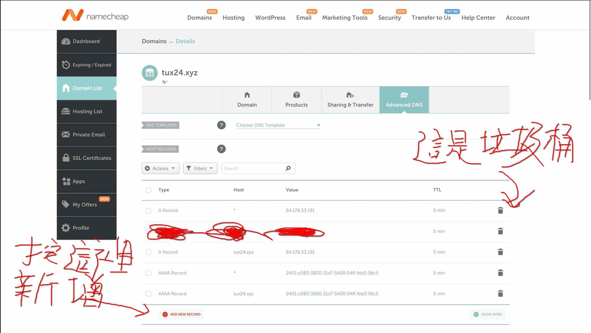

# 開始！

現在我們已經有了一個域名和一臺主機，可以透過一種叫做 DNS 記錄（DNS Record）的東西將兩者連結起來。DNS 記錄通常要到你的域名註冊商（以上一篇文章來說是 Name Cheap）那邊設定。設定完成後，全世界的人都能透過你的域名連結到你的主機。

這篇文章可以說是[**這篇文章**](https://landchad.net/basic/dns/)的中文翻譯＋更新版，我當初也是看著 landchad.net 的教學架好這個網站的，所以如果你覺得我寫的很爛 ... 你可以去看英文版沒關係。

# 今天要做的事情很簡單

首先，打開域名和主機的管理頁面。

以我的示範來說，就是 Name Cheap 和 Vultr 的頁面。

你可以先開好兩個分頁，等下我們會切來切去的。

首先打開 Name Cheap 的 DNS 管理頁面：



通常 DNS Record 這邊域名商會幫你預先填好一些東西，把它們全部刪掉（按垃圾桶）。

然後我們到主機的管理頁面，點下去。


_我有必要這麼詳細的教你怎麼點嗎 ..._


看到你的 IPv4 和 IPv6 位址了嗎？我們要把它們複製起來，貼到域名商那邊：


我已經貼好了（當然），規則很簡單：A Record 貼 IPv4 位址，AAAA Record 貼 IPv6 位址，都貼在 Value 那欄；Host 值各填一個 `*` 和你的域名，像我就填 `tux24.xyz`。

填好記得儲存變更，過幾分鐘後來確認有沒有成功吧：

到終端機（[那是什麼？](https://wiwi.blog/blog/why-use-terminal)）輸入：

```
ping 你的域名
```

如果輸出像是這樣的話：


代表你成功了！
