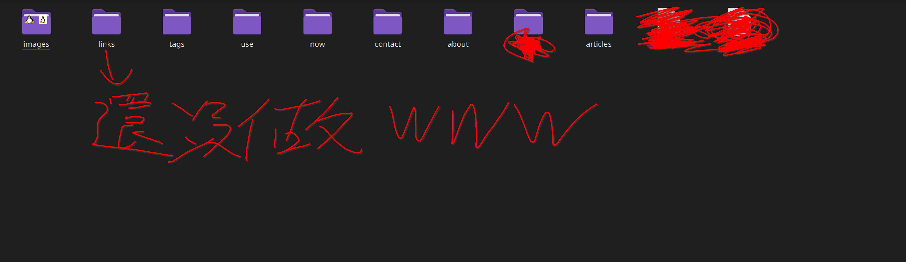

好了，教學 5，廢話不多說，開始吧。

# 解釋

我的這個網站利用一個叫做 Hugo 的工具所架設，Hugo 能把你用 Markdown 寫好的普通文章配合你所選擇的主題樣式轉換成 html，也就是生成你現在所看到的網頁。Hugo 尤其適合那些想要 Blog 簡潔又漂亮的人。

當然，你也可以自己加上 Javascript, 自訂 CSS 什麼的，不過我的教學裡不會有這些，因為：

1. 如果你會自己加這些你也不需要我教了嘛。
2. 這些東西拖慢網站的載入速度、沒辦法被純文字瀏覽器存取、可能會被廣告攔截器攔截、不尊重讀者（除了少數例外，例如搜尋功能），太不 [Based](https://tux24.xyz/articles/based) 了。

總之，我覺得不需要這些東西，你可以去檢查我的網站是不是沒有任何追蹤器、Javascript 和廣告。

然後我會利用 git + GitHub 來控制網站上的文章，如果你不知道那是什麼的話，可以去看一下這裡，有詳細的解說。不過我們其實用不到那麼多功能，以我為例，我也只用了一條 main 分支而已。

其實 git 並非必要，你也可以用 rsync 之類的工具來達成同步文章的效果，不過用 git 的話想開放網站的原始碼也比較方便。

當然，你不一定要選擇 GitHub 作為遠端儲存庫，你都有自己的主機了，去看 landchad.net 的教程架個 Gitea 什麼的也可以。

忘了寫，因為這個原因，我的網站沒有留言板，教學裡當然也不會有。

我認為比較好的方式是讓讀者和作者直接聯絡，透過 E-mail 或是線下見面，如果可以的話，讀者自己寫在自己的 Blog 不是更好？

# 架網站第六步：搞定 Hugo
## 本機安裝 hugo & git & github-cli & micro（之後都有用）

Linux 用戶我不教了，你不可能不會吧？

Mac 用戶要先安裝叫做 homebrew 的東西，然後：

```bash
brew install hugo git github-cli micro
# 應該是這樣吧，其實我沒有用過 Mac OS
```

Windows 用戶就用你們原本習慣的方式安裝軟體吧，我衷心建議你趕快[切換到 linux](https://wiwi.blog/docs/tech/your-computer-is-not-yours/)，別再用那種折磨人的軟體安裝流程了。

## 建立網站架構

輸入以下指令，我對 Linux 用戶的建議是在你的家目錄輸入：

```bash
hugo new site yourwebsite # 記得替換 ...
cd yourwebsite
git init
git submodule add https://github.com/luizdepra/hugo-coder.git themes/hugo-coder
```

首先是建立你的網站架構，再來是用 git 來管理你的網站，最後一個指令會幫你裝好主題（就一個指令！）。

然後你要修改你的網站基礎設定，下面放的是 hugo-coder 主題作者提供的極簡範例，更多調整細節請看[這裡](https://github.com/luizdepra/hugo-coder/blob/main/docs/configurations.md)：

```toml
baseurl = "http://www.example.com"
title = "johndoe"
theme = "hugo-coder"
languagecode = "en"
defaultcontentlanguage = "en"


[pagination]
pagerSize = 20

[services]
[services.disqus]
shortname = "yourdiscussshortname"

[markup.highlight]
style = "github-dark"

[params]
  author = "John Doe"
  info = "Full Stack DevOps and Magician"
  description = "John Doe's personal website"
  keywords = "blog,developer,personal"
  avatarurl = "images/avatar.jpg"
  #gravatar = "john.doe@example.com"

  faviconSVG = "/img/favicon.svg"
  favicon_32 = "/img/favicon-32x32.png"
  favicon_16 = "/img/favicon-16x16.png"

  since = 2019

  enableTwemoji = true

  colorScheme = "auto"
  hidecolorschemetoggle = false

  # customCSS = ["css/custom.css"]
  # customSCSS = ["scss/custom.scss"]
  # customJS = ["js/custom.js"]

[taxonomies]
  category = "categories"
  series = "series"
  tag = "tags"
  author = "authors"

# Social links
[[params.social]]
  name = "Github"
  icon = "fa-brands fa-github fa-2x"
  weight = 1
  url = "https://github.com/johndoe/"
[[params.social]]
  name = "Gitlab"
  icon = "fa-brands fa-gitlab fa-2x"
  weight = 2
  url = "https://gitlab.com/johndoe/"
[[params.social]]
  name = "Twitter"
  icon = "fa-brands fa-x-twitter fa-2x"
  weight = 3
  url = "https://twitter.com/johndoe/"

# Menu links
[[menu.main]]
  name = "Blog"
  weight = 1
  url  = "posts/"
[[menu.main]]
  name = "About"
  weight = 2
  url = "about/"
```

我知道，你可能會想要看我的：

```toml
baseURL = 'https://tux24.xyz/' # 網站域名，這個很重要
languageCode = 'zh-TW' # 看你想寫哪國語言的文章
title = "tux24 的個人網站" # 網站左上角的標題
theme = "hugo-coder" # 就寫 hugo-coder，別亂動

#baseurl = "http://www.example.com"
#title = "johndoe"
#theme = "hugo-coder"
#languagecode = "en"
#defaultcontentlanguage = "en"


[pagination]
pagerSize = 20

[service]

[markup.highlight] # 網站內程式碼的 highlight 規則，自己去看官方文件
style = "doom-one2"

[params]
  author = "tux24"
  info = "想認識我的話，就透過這個網站吧"
  description = "tux24 的個人網站"
  avatarurl = "images/avatar.jpg" # 就是我首頁那張圖，自己改連結，我建議放在 content/images，然後看你的檔名
  #gravatar = "john.doe@example.com"

  faviconSVG = "images/favicon.svg" # 網站小圖示，我也是放在 content/images
  favicon_32 = "images/favicon-32x32.png"
  favicon_16 = "images/favicon-16x16.png"

  since = 2024 # 網站創始年份

  enableTwemoji = true

  colorScheme = "auto"
  hidecolorschemetoggle = false

  # customCSS = ["custom.css"]
  # customSCSS = ["scss/custom.scss"]
  # customJS = ["js/custom.js"]

[taxonomies] # 這裡不要動
  category = "categories"
  series = "series"
  tag = "tags"
  author = "authors"

# Social links
# 這裡要放首頁個人圖片下面那些按鈕，怎麼寫請參考 hugo-coder 的官方文件
[[params.social]]
  name = "Github"
  icon = "fa-brands fa-github fa-2x"
  weight = 1
  url = "https://github.com/tux24xyz/"

[[params.social]]
  name = "RSS"
  icon = "fa-solid fa-rss fa-2x"
  weight = 2
  url = "https://tux24.xyz/index.xml"
  rel = "alternate"
  type = "application/rss+xml"

# Menu links
# 這裡可以調整網站右上角出現的東西，weight 的數字越大越靠右（手機的話是靠下方） 
# url 就寫你給那個資料夾的名字
# 詳情請見我的教學文章 https://tux24.xyz/articles/build-your-own-website-5
[[menu.main]]
  name = "文章"
  weight = 1
  url  = "articles/"
[[menu.main]]
  name = "關於"
  weight = 2
  url = "about/"
[[menu.main]]
  name = "近況"
  weight = 3
  url = "now/"
[[menu.main]]
  name = "連結"
  weight = 4
  url = "links/"
[[menu.main]]
  name = "工具"
  weight = 5
  url = "use/"
[[menu.main]]
  name = "標籤"
  weight = 6
  url = "tags/"
[[menu.main]]
  name = "聯絡我"
  weight = 7
  url = "contact/"

# 我想，聰明一點的讀者看得出來要怎麼改
# 不聰明的讀者，我的意思是要照著我幫你寫好的註解改
```

## hugo 原理

我接著要來解釋原理了

我希望你們先觀察一下我的網站目前的網址長什麼樣子：

```
# https://tux24.xyz/articles/build-your-own-website-5/index.md
```

然後是我的網站目錄下的 content 目錄：



觀察到了吧，這個 content 的作用其實就是網站的根目錄，換句話說，你的網站的內容（不就是 content 嗎？）都在這個目錄下。

我自己的作法是把文章放在 articles/ 下，剩下的像是 now, about, use 這些其實就是 slashpages，重要的獨立文章。

再來是文章怎麼放，有兩種方法：

1. 每篇文章都是一個獨立的 Markdown 檔案（副檔名為 .md）
2. 每篇文章都是一個目錄，目錄下放一個 index.md 把文章寫在裡面（這種方法又叫做 page bundle）

聰明的讀者應該已經從剛才的網址看出我用的是二號方法了吧？

我推薦第二種方法，因為比較方便管理。而且，請你找出剛才的圖片的連結，你會發現二號方法的好處。

_（這樣好像在玩解謎遊戲喔，我突然想到前幾年玩過的一個網頁解謎遊戲：[combinats.com](https://combinats.com/)。留給你們探索了。[^1]）_

[^1]: 這個遊戲是我當年在已經關掉的 [nicelink.me 好連點我](https://nicelink.me)找到的

## 測試

所以讓我們用二號方法建立測試用文章吧：

```bash
hugo new articles/helloworld/index.md
```

加入以下內容，

```markdown
---
title: "架網站教學 Pt.5 - Hugo - 測試"
date: 2025-08-05T09:26:25+08:00 # 撰寫時間
publishDate: T06:00:00+08:00  # 預約之後發布
#lastmod: 2025-06-30 # 最後修改時間
draft: false
#tags: ["🖥️科技", "📝創作", "⭐️重要"]

# 文章設定
toc: true         # 是否顯示目錄
math: false       # 是否啟用數學公式
code: true        # 是否有程式碼
---

# Hello World!

哈囉！


這是我首頁那隻企鵝

```


最上面用分隔線圍起來的東西叫做 yaml frontmatter，你們可以自己研究要怎麼寫，不過我覺得我的模板已經夠用。之後我還會再提到，這裡就不解釋原理了。

至於分隔線下的 Markdown 文章要怎麼寫，建議你們去看[這個教學影片](https://wiwi.video/w/m2rLULr2rtrroZkoLEDfHy)，進階語法之後邊寫邊學就好。

然後回到　yourwebsite/ 下，輸入指令：

```bash
hugo server
```

開啟瀏覽器，輸入 `http://localhost:1313` 就能看到自己的網站樣子。

測試成功！

_(想關掉這個測試頁的話，在終端機裡按 Ctrl + C)_

