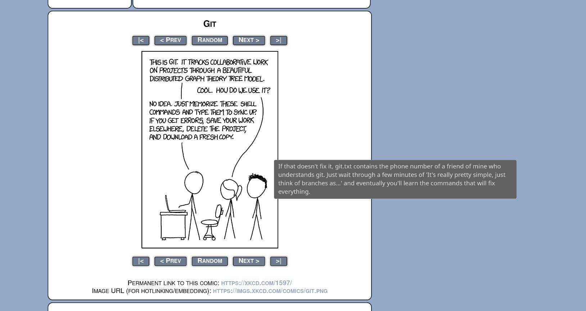

# 架網站第八步：自動化 II

## 這樣還是太麻煩了

我懂，我當時也是這麼想的，所以我有第二個腳本幫你生成每篇文章最上面的 Frontmatter。

這個腳本會問你這篇文章的標題、要使用的標籤以及特殊功能：它會問你文章要使用的文件名[^1]—最後會出現在網址列的那串英文字[^2]。回答完問題它就會自動在 content 下的 articles 下建立一個目錄（名字你剛才取了），並且在目錄裡自動建立好 images 目錄（讓你放這篇文章需要用到的圖片）以及 index.md。

index.md 裡會有完整的 Frontmatter，包含你剛回答的文章標題以及腳本自動填入的文章撰寫時間。其他我寫的預設值你不滿意的話可以自己改模板，下面有教學。

你要做的只是打開 index.md，開始寫，沒了。就這麼 [Based](https://tux24.xyz/articles/based)。

我的腳本在這：

```bash
#!/bin/bash

# 交互式寫作腳本
# 使用方法: ./start-writing.sh

set -e

# 顏色定義
RED='\033[0;31m'
GREEN='\033[0;32m'
YELLOW='\033[1;33m'
BLUE='\033[0;34m'
CYAN='\033[0;36m'
MAGENTA='\033[0;35m'
NC='\033[0m' # No Color

# 配置變數
TEMPLATE_DIR="templates"          # 模板目錄
POSTS_DIR="./content/articles"         # 文章目錄

# 預設標籤（你可以修改這個列表）
AVAILABLE_TAGS=(
    "🎵音樂" "🔬科學" "🖥️科技" "🎨美術" "📚️閱讀" 
    "🛟生活" "🐧我的事" "💭哲學" "🎥電影" "💦動畫" 
    "📝創作" "🤔觀察" "🎮️遊戲" "🤪有趣" "⭐️重要"
    "✈️旅遊" "💪健康"
)

# 函數：輸出彩色訊息
log_info() {
    echo -e "${BLUE}[INFO]${NC} $1"
}

log_success() {
    echo -e "${GREEN}[SUCCESS]${NC} $1"
}

log_warning() {
    echo -e "${YELLOW}[WARNING]${NC} $1"
}

log_error() {
    echo -e "${RED}[ERROR]${NC} $1"
}

log_prompt() {
    echo -e "${CYAN}[PROMPT]${NC} $1"
}

# 函數：創建目錄
create_directories() {
    mkdir -p "$TEMPLATE_DIR"
}

# 函數：列出可用模板
list_templates() {
    if [ ! -d "$TEMPLATE_DIR" ]; then
        log_error "模板目錄不存在: $TEMPLATE_DIR"
        return 1
    fi
    
    local templates=($(find "$TEMPLATE_DIR" -name "*.md" -type f))
    
    if [ ${#templates[@]} -eq 0 ]; then
        log_warning "沒有找到模板文件"
        log_info "請在 $TEMPLATE_DIR 目錄中創建 .md 模板文件"
        return 1
    fi
    
    echo -e "\n${MAGENTA}=== 可用模板 ===${NC}"
    for i in "${!templates[@]}"; do
        local basename=$(basename "${templates[$i]}" .md)
        echo -e "${YELLOW}$((i+1)).${NC} $basename"
    done
    
    return 0
}

# 函數：選擇模板
select_template() {
    local templates=($(find "$TEMPLATE_DIR" -name "*.md" -type f))
    
    while true; do
        log_prompt "請選擇模板 (輸入數字):"
        read -r template_choice
        
        if [[ "$template_choice" =~ ^[0-9]+$ ]] && [ "$template_choice" -ge 1 ] && [ "$template_choice" -le ${#templates[@]} ]; then
            SELECTED_TEMPLATE="${templates[$((template_choice-1))]}"
            log_info "已選擇模板: $(basename "$SELECTED_TEMPLATE" .md)"
            break
        else
            log_error "無效選擇，請輸入 1-${#templates[@]} 之間的數字"
        fi
    done
}

# 函數：顯示標籤選擇
show_tag_selection() {
    echo -e "\n${MAGENTA}=== 可用標籤 ===${NC}"
    for i in "${!AVAILABLE_TAGS[@]}"; do
        local num=$((i+1))
        if [ $num -le 9 ]; then
            echo -e "${YELLOW} $num.${NC} ${AVAILABLE_TAGS[$i]}"
        else
            echo -e "${YELLOW}$num.${NC} ${AVAILABLE_TAGS[$i]}"
        fi
    done
}

# 函數：選擇標籤
select_tags() {
    local selected_tags=()
    
    show_tag_selection
    
    echo -e "\n${CYAN}標籤選擇說明：${NC}"
    echo "- 輸入數字選擇標籤 (例如: 1,3,5)"
    echo "- 輸入 'c' 自定義標籤"
    echo "- 輸入 'done' 完成選擇"
    echo "- 輸入 'show' 重新顯示標籤列表"
    
    while true; do
        log_prompt "請選擇標籤 (當前已選: ${selected_tags[*]}):"
        read -r tag_input
        
        case "$tag_input" in
            "done")
                if [ ${#selected_tags[@]} -eq 0 ]; then
                    log_warning "至少選擇一個標籤"
                    continue
                fi
                break
                ;;
            "show")
                show_tag_selection
                ;;
            "c")
                log_prompt "請輸入自定義標籤:"
                read -r custom_tag
                if [ -n "$custom_tag" ]; then
                    selected_tags+=("$custom_tag")
                    log_success "已添加自定義標籤: $custom_tag"
                fi
                ;;
            *)
                # 處理數字選擇
                IFS=',' read -ra tag_numbers <<< "$tag_input"
                for num in "${tag_numbers[@]}"; do
                    # 去除空格
                    num=$(echo "$num" | xargs)
                    if [[ "$num" =~ ^[0-9]+$ ]] && [ "$num" -ge 1 ] && [ "$num" -le ${#AVAILABLE_TAGS[@]} ]; then
                        local tag="${AVAILABLE_TAGS[$((num-1))]}"
                        # 檢查是否已經選擇
                        if [[ ! " ${selected_tags[*]} " =~ " $tag " ]]; then
                            selected_tags+=("$tag")
                            log_success "已添加標籤: $tag"
                        else
                            log_warning "標籤 '$tag' 已經選擇過了"
                        fi
                    else
                        log_error "無效的標籤編號: $num"
                    fi
                done
                ;;
        esac
    done
    
    # 修復：直接生成正確的 YAML 格式字符串，不包含外層方括號
    SELECTED_TAGS_YAML=""
    for tag in "${selected_tags[@]}"; do
        if [ -z "$SELECTED_TAGS_YAML" ]; then
            SELECTED_TAGS_YAML="\"$tag\""
        else
            SELECTED_TAGS_YAML="$SELECTED_TAGS_YAML, \"$tag\""
        fi
    done
    
    log_info "最終選擇的標籤: [$SELECTED_TAGS_YAML]"
}

# 函數：獲取文章標題
get_article_title() {
    while true; do
        log_prompt "請輸入文章標題:"
        read -r article_title
        
        if [ -n "$article_title" ]; then
            ARTICLE_TITLE="$article_title"
            break
        else
            log_error "標題不能為空"
        fi
    done
}

# 函數：生成文件名
generate_filename() {
    #local date=$(date '+%Y-%m-%d')
    # 簡單的文件名處理：移除特殊字符，替換空格為連字符
    #local safe_title=$(echo "$ARTICLE_TITLE" | sed 's/[^a-zA-Z0-9\u4e00-\u9fff ]//g' | sed 's/ /-/g' | sed 's/--*/-/g')
    #ARTICLE_FILENAME="$ARTICLE_TITLE.md"
    while true; do
        log_prompt "請輸入文件名:"
        read -r file_name
        
        if [ -n "$file_name" ]; then
            ARTICLE_FILENAME="$file_name.md"
            break
        else
            log_error "文件名不能為空"
        fi
    done
    ARTICLE_FILEPATH="${POSTS_DIR}/${ARTICLE_FILENAME}"
}

# 函數：處理模板變數替換
process_template() {
    local current_time=$(date '+%Y-%m-%dT%H:%M:%S+08:00')
    
    # 讀取模板內容
    local template_content=$(cat "$SELECTED_TEMPLATE")
    
    # 替換變數 - 將標題用引號包起來
    template_content=$(echo "$template_content" | sed "s/{{TITLE}}/\"$ARTICLE_TITLE\"/g")
    template_content=$(echo "$template_content" | sed "s/{{DATE}}/$current_time/g")
    # 修復：在模板替換時直接加上方括號，生成正確的 YAML 數組格式
    template_content=$(echo "$template_content" | sed "s/{{TAGS}}/[$SELECTED_TAGS_YAML]/g")
    
    # 寫入新文件
    echo "$template_content" > "$ARTICLE_FILEPATH"
}

# 函數：創建文章資料夾並重新組織文件
organize_article_files() {
    # 獲取不含副檔名的文件名
    local filename_without_ext="${ARTICLE_FILENAME%.*}"
    local folder_path="${POSTS_DIR}/${filename_without_ext}"
    
    log_info "正在創建文章資料夾: $filename_without_ext"
    
    # 創建同名資料夾
    mkdir -p "$folder_path"

    # 創建圖片資料夾
    mkdir -p "$folder_path/images"
    
    # 移動文件到資料夾中並重命名為 index.md
    local new_filepath="${folder_path}/index.md"
    mv "$ARTICLE_FILEPATH" "$new_filepath"
    
    # 更新文件路徑變數
    ARTICLE_FILEPATH="$new_filepath"
    
    log_success "文章已組織到資料夾: $folder_path/index.md"
}

# 主函數
main() {
    echo -e "${MAGENTA}"
    echo "╔══════════════════════════════════════╗"
    echo "║        快速寫作助手 v1.0             ║"
    echo "╚══════════════════════════════════════╝"
    echo -e "${NC}"
    
    # 創建必要目錄
    create_directories
    
    # 列出並選擇模板
    log_info "步驟 1: 選擇文章模板"
    if ! list_templates; then
        log_error "無法繼續，請先創建模板文件"
        exit 1
    fi
    select_template
    
    # 獲取文章標題
    log_info "步驟 2: 設定文章標題"
    get_article_title
    
    # 選擇標籤
    log_info "步驟 3: 選擇文章標籤"
    select_tags
    
    # 生成文件名
    generate_filename
    
    # 檢查文件是否已存在
    if [ -f "$ARTICLE_FILEPATH" ]; then
        log_warning "文件已存在: $ARTICLE_FILEPATH"
        log_prompt "是否覆蓋? (y/N):"
        read -r overwrite
        if [[ ! "$overwrite" =~ ^[Yy]$ ]]; then
            log_info "操作取消"
            exit 0
        fi
    fi
    
    # 處理模板並創建文章
    log_info "步驟 4: 創建文章文件"
    process_template
    
    # 組織文章文件到資料夾中
    log_info "步驟 5: 組織文章文件"
    organize_article_files
    
    echo -e "\n${GREEN}🎉 寫作準備完成！祝你寫作愉快！${NC}"
}

# 錯誤處理
trap 'log_error "腳本執行過程中發生錯誤"; exit 1' ERR

# 執行主函數
main "$@"
```

腳本如何使用呢？

一樣，把腳本內容貼到文字編輯器裡，存成 .sh 檔，放在你網站的根目錄（我指的是 content 的上一層），
然後你先運行一次腳本。

一定會報錯，別緊張，你現在要到網站根目錄多出來的那個 `templates` 目錄裡面建立一個 .md 檔，檔名隨便取。在 md 檔裡面貼上這樣的內容：

```markdown
---
title: {{TITLE}} # 你剛才回答的標題
date: {{DATE}} # 撰寫時間
publishDate: T06:00:00+08:00  # 預約之後發布，我自己會每次寫文章時重新填一遍。
# 格式範例：2025-08-09T06:00:00+08:00
# 因為台灣是 UTC + 8 所以最後要寫 +08:00
# 我預設早上六點發布
#lastmod: 2025-06-30 # 最後修改時間，我預設關掉這個功能
draft: true # 我預設開 true 避免誤發，你也可以改成 false
tags: {{TAGS}} # 不要動這個

# 文章設定
toc: true         # 是否顯示目錄
math: false       # 是否啟用數學公式
code: true        # 是否有程式碼
---
```

這就是 Frontmatter 的模板，如果你不滿意的話可以自己改。

你可以寫不只一個模板。

關於文章的標籤，我之後會詳細介紹，你先自己把腳本內的標籤列表改成你喜歡的樣子。

## 還有沒有別的腳本？

... 有的

以下是快速拉取 github 上的最新網站內容的小腳本：

```bash
#!/bin/bash

# GitHub 內容拉取腳本
# 使用方法: ./pull-updates.sh
# 功能: 從 GitHub 獲取最新的網站內容，適用於多電腦同步

set -e  # 遇到錯誤立即停止

# 顏色定義
RED='\033[0;31m'
GREEN='\033[0;32m'
YELLOW='\033[1;33m'
BLUE='\033[0;34m'
CYAN='\033[0;36m'
NC='\033[0m' # No Color

# 函數：輸出彩色訊息
log_info() {
    echo -e "${BLUE}[INFO]${NC} $1"
}

log_success() {
    echo -e "${GREEN}[SUCCESS]${NC} $1"
}

log_warning() {
    echo -e "${YELLOW}[WARNING]${NC} $1"
}

log_error() {
    echo -e "${RED}[ERROR]${NC} $1"
}

log_step() {
    echo -e "${CYAN}[STEP]${NC} $1"
}

# 顯示開始訊息
echo "=================================="
log_info "GitHub 內容拉取腳本"
log_info "時間: $(date '+%Y-%m-%d %H:%M:%S')"
echo "=================================="

# 1. 檢查是否在 Git 倉庫中
log_step "檢查 Git 倉庫狀態..."
if [ ! -d ".git" ]; then
    log_error "當前目錄不是 Git 倉庫！"
    log_info "請確保你在網站根目錄中執行此腳本"
    exit 1
fi

# 2. 檢查網路連接
log_step "檢查網路連接..."
if ! ping -c 1 github.com &> /dev/null; then
    log_error "無法連接到 GitHub，請檢查網路連接"
    exit 1
fi
log_success "網路連接正常"

# 3. 檢查當前分支
CURRENT_BRANCH=$(git branch --show-current)
log_info "當前分支: $CURRENT_BRANCH"

# 4. 檢查本地是否有未提交的變更
log_step "檢查本地變更狀態..."
if ! git diff --quiet || ! git diff --cached --quiet; then
    log_warning "發現未提交的本地變更！"
    echo ""
    echo "=== 未提交的變更 ==="
    git status --short
    echo "===================="
    echo ""
    
    # 詢問用戶如何處理
    echo "請選擇處理方式："
    echo "1) 暫存變更並繼續拉取 (git stash)"
    echo "2) 放棄本地變更並強制拉取"
    echo "3) 取消操作"
    read -p "請輸入選擇 (1-3): " choice
    
    case $choice in
        1)
            log_info "暫存本地變更..."
            git stash push -m "Auto-stash before pull: $(date '+%Y-%m-%d %H:%M:%S')"
            STASHED=true
            ;;
        2)
            log_warning "放棄本地變更..."
            git reset --hard HEAD
            git clean -fd
            ;;
        3)
            log_info "操作已取消"
            exit 0
            ;;
        *)
            log_error "無效的選擇，操作取消"
            exit 1
            ;;
    esac
else
    log_success "沒有未提交的變更"
    STASHED=false
fi

# 5. 獲取遠端資訊
log_step "獲取遠端倉庫資訊..."
git fetch origin

# 6. 檢查是否有新的提交
LOCAL_COMMIT=$(git rev-parse HEAD)
REMOTE_COMMIT=$(git rev-parse origin/$CURRENT_BRANCH)

if [ "$LOCAL_COMMIT" = "$REMOTE_COMMIT" ]; then
    log_success "本地已是最新版本！"
    
    # 如果之前有暫存變更，詢問是否恢復
    if [ "$STASHED" = true ]; then
        echo ""
        read -p "是否要恢復之前暫存的變更？ (y/n): " restore_choice
        if [ "$restore_choice" = "y" ] || [ "$restore_choice" = "Y" ]; then
            log_info "恢復暫存的變更..."
            git stash pop
            log_success "變更已恢復"
        else
            log_info "暫存的變更保持不動，可用 'git stash pop' 手動恢復"
        fi
    fi
    
    exit 0
fi

# 7. 顯示將要拉取的變更
log_step "顯示即將拉取的變更..."
echo ""
echo "=== 新的提交 ==="
git log --oneline $LOCAL_COMMIT..$REMOTE_COMMIT
echo "================="
echo ""

# 8. 拉取最新內容
log_step "拉取最新內容..."
if git pull origin $CURRENT_BRANCH; then
    log_success "成功拉取最新內容！"
else
    log_error "拉取失敗！"
    
    # 如果有暫存的變更且拉取失敗，提醒用戶
    if [ "$STASHED" = true ]; then
        log_warning "注意：你的本地變更已暫存，可用 'git stash pop' 恢復"
    fi
    exit 1
fi

# 9. 更新子模組（如果有的話，比如 Hugo 主題）
if [ -f ".gitmodules" ]; then
    log_step "更新子模組..."
    git submodule update --init --recursive
    log_success "子模組更新完成"
fi

# 10. 顯示更新摘要
echo ""
echo "=== 更新摘要 ==="
NEW_COMMIT=$(git rev-parse HEAD)
echo "• 從提交: ${LOCAL_COMMIT:0:7}"
echo "• 更新到: ${NEW_COMMIT:0:7}"
echo "• 新增提交數: $(git rev-list --count $LOCAL_COMMIT..$NEW_COMMIT)"
echo "================="

# 11. 恢復暫存的變更（如果有的話）
if [ "$STASHED" = true ]; then
    echo ""
    read -p "是否要恢復之前暫存的變更？ (y/n): " restore_choice
    if [ "$restore_choice" = "y" ] || [ "$restore_choice" = "Y" ]; then
        log_step "恢復暫存的變更..."
        if git stash pop; then
            log_success "變更已成功恢復"
        else
            log_warning "恢復變更時出現衝突，請手動解決"
            log_info "你可以使用以下命令查看狀態："
            echo "  git status"
            echo "  git diff"
        fi
    else
        log_info "暫存的變更保持不動"
        log_info "如需恢復，請執行: git stash pop"
    fi
fi

# 12. 顯示當前狀態
echo ""
log_step "當前倉庫狀態："
echo "• 分支: $(git branch --show-current)"
echo "• 最新提交: $(git log -1 --pretty=format:'%h - %s (%cr)' --abbrev-commit)"
echo "• 工作目錄: $(pwd)"

# 13. 檢查是否需要其他操作
echo ""
log_info "拉取完成！"
log_warning "注意事項："
echo "• 如果網站內容有更新，你可能需要重新建置網站"
echo "• 如果配置文件有變更，請檢查相關設定"
echo "• 如果有新的依賴，可能需要重新安裝"

echo ""
log_success "所有操作完成！"
```

由於我們只使用一個 `main` 分支，應該是不會碰到什麼問題。

這個腳本是給需要在多台電腦上更新網站的人（像是我）用的，用法如下：

## 以後的寫文章流程

1. 每次開始寫作前先運行一次三號腳本，確保本地的網站內容是最新版，尤其是當你換了一台電腦寫作時。
2. 運行二號腳本，建立好文章
3. 開始寫作
4. 寫好後，記得設定好發佈日期、確保 `draft: false`
5. 運行一號腳本

## 其實差不多了，就這樣而已

想要架好網站，這八步其實就夠了，接下來的教學將會是一些網站閱讀體驗優化的技巧、寫作小秘訣 ... 等等。

不過你也有新東西要學：

1. Git
2. [Markdown](https://tux24.xyz/articles/markdown-magic)
3. 可能還有終端機，如果你從未接觸過的話

但不會花你太多時間的，畢竟沒學 Git 也能用嘛：



關於學習 Markdown 和終端機，wiwi 都做過簡單的教學影片了。以架網站來說，這樣足矣：

1. [Markdown](https://wiwi.video/w/m2rLULr2rtrroZkoLEDfHy)
2. [終端機](https://wiwi.video/w/3QdSEB3yJNXQnvv5gJN7ec)

[^1]: 有看上上篇文章的人就知道其實是目錄名
[^2]: 建議格式：只使用小寫英文字母、數字和短的半形連字號 -