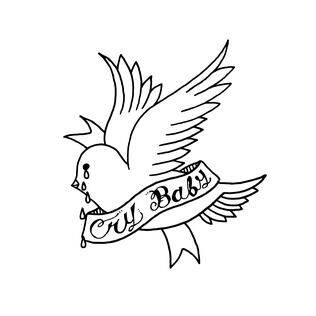
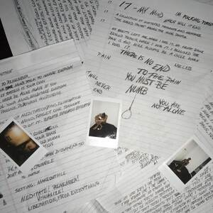
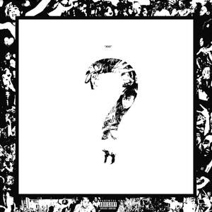

我想和你介紹兩位我很喜歡的音樂家：

Lil Peep，以及 XXXTENTACION。

我覺得要說他們有什麼共通點的話，其中一個是，「幼稚」[^1]。

# 「幼稚」是什麼？

對我來說，「幼稚」指的是：有想法，但技術跟不上導致被批評、被討厭。你也可以說是「青澀」、「不成熟」。

以 XXXTENTACION 舉例好了，他在世時發布的兩張專輯 ... 老實說聽起來比較像是混音帶，整體聽的體驗不是很好，有些曲目只是重複同一個 loop，可以說不是最理想的狀態。

但這就是「幼稚」的涵義：還不是最理想的狀態，未來可能會的。

「幼稚」的作品不一定會被所有人討厭，不信你搜尋剛才那兩個人名看看。

# schizophrenia

以 "schizophrenia" 這首歌來說，雖然 X 只是重複的大吼：

> Don't give up, don't give up!

但這是我整張專輯最喜歡的曲目。

老實說，沒有什麼可以寫的，畢竟只有 1:20 的長度 ... 真是「幼稚」的音樂評論啊。

_每次我對自己感到懷疑時都會回來聽一次這段精神喊話，本來這篇文章不會發布的，多虧了 X 的鼓勵我才鼓起勇氣，願你安息🕊️_

# 欣賞「幼稚」

我覺得幼稚的作品中一定有有趣的、值得探索的地方（如果你有看我以前的文章，希望你也這樣想🤣），只是比較容易被更成熟、精鍊的作品蓋過。

我還很小、還很菜、還有時間，我要不要繼續發布這些幼稚文章呢？我的答案是肯定的，如果我未來還會像現在這樣不停的發文，那就意味著讀者比較容易看到最新、或是我挑選出來的文章。這樣一來，這些幼稚的想法頂多只是成為我的黑歷史罷了。

再說，我已經超越身邊所有的同齡人了，有什麼好怕的呢？

不繼續胡言亂語了，我應該去練習一下寫作[^2]。

# 為什麼寫這篇文章？

我開始擔心自己的文章是否只是因為中文圈架個人網站的人少才會被看見，[實際價值](https://wiwi.blog/blog/art-value)其實低的可憐。而且看越多[別人寫的文章](https://blog.giveanornot.com/shitposts/)越覺得事實如此，直到今天發現好像不是只有我[這樣](https://skyhong2002.blogspot.com/)[^3]。

我想鼓勵一下一樣覺得自己「幼稚」的人：這可能是一個必經的過程，就是覺得自己「幼稚」、「很尷尬」才會想要進步啊！

還有，有作品、[有人認識自己](https://tux24.xyz/articles/monika-and-taleb/)總比沒有好 ... 吧？

# 我的文章都很幼稚

不只是這篇，還有我寫過的快五十篇文章，我全都覺得很幼稚：文筆不太好、觀點不是太有啟發性、有些 ... 只是[廢文](https://tux24.xyz/articles/bad-articles-dont-belong-here/)。

但幼稚不代表它完全不值得你去讀，畢竟或許你可以在那裡找到以前的自己？（我亂說的）

[^1]: 還有 "emo" 和「死了」，這個我之後可能再寫
[^2]: 這段是最後寫的
[^3]: 對不起 [Sky](https://skyhong.tw/)，把你的黑歷史翻出來