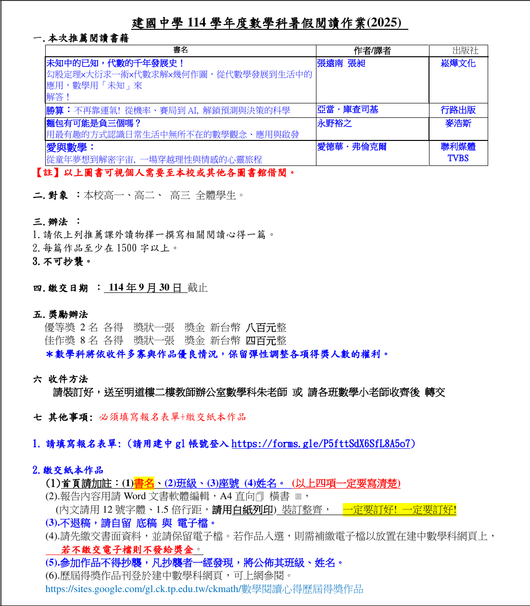

# 為什麼我要寫[上一篇文章](https://tux24.xyz/articles/why-should-you-use-open-format-\?/)

因為我在建中的新生手冊上看到了這個：

看到最下面的「報告請用 Word 編輯」了嗎？

我打算用 LibreOffice Writer 做這份作業（因為我不會 LaTex 🤦‍♂️），如果老師不接受的話，我就丟我寫的「[論點](https://tux24.xyz/articles/why-should-you-use-open-format)」 給他。

# 話說那個作業 ...

以上四本書都不好找，圖書館排不到。所以我前天（2025-07-19）乾脆直接到書局找。是找到了「愛與數學」沒錯啦，不過為了這個暑假作業買一本討厭的書 ...

我順便買了一本卡夫卡的《審判》，還沒讀過，之後有空來寫一下心得什麼的。
