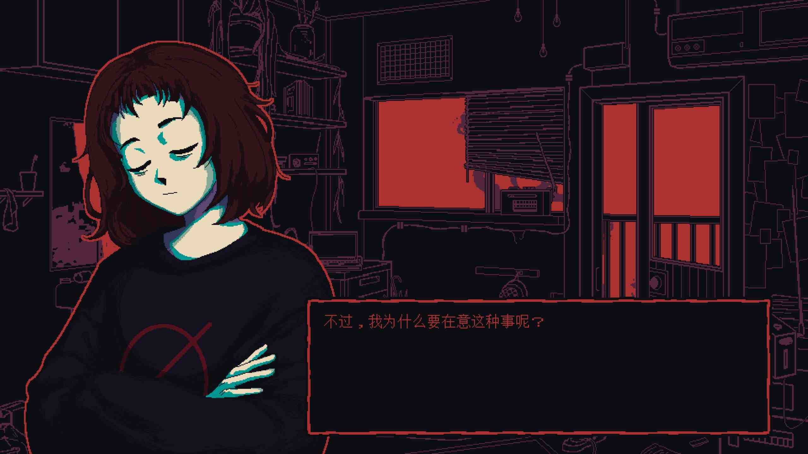
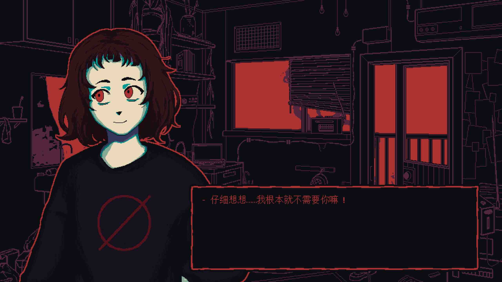
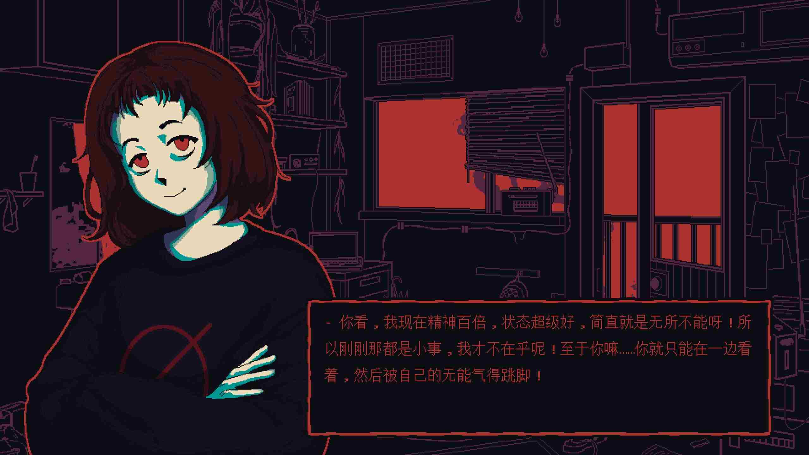
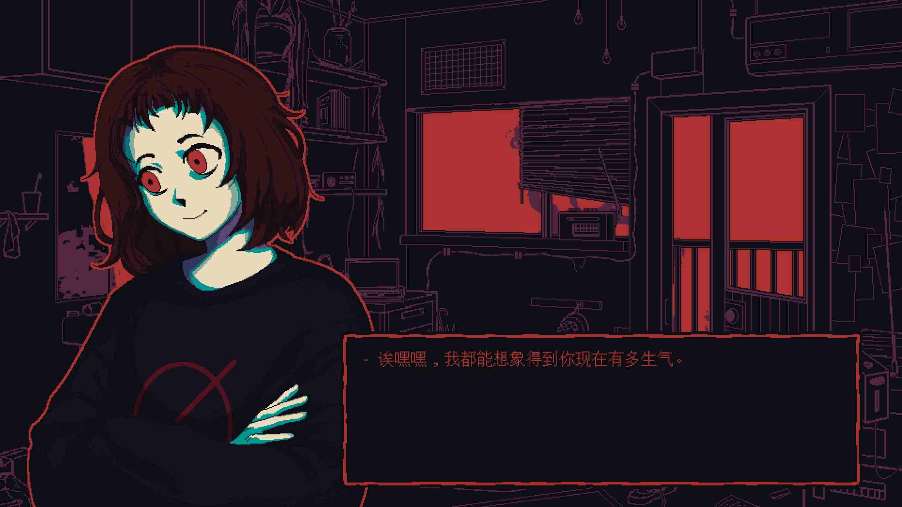
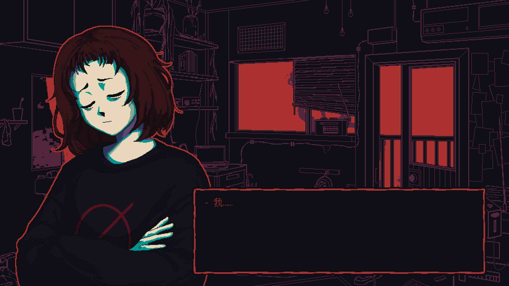
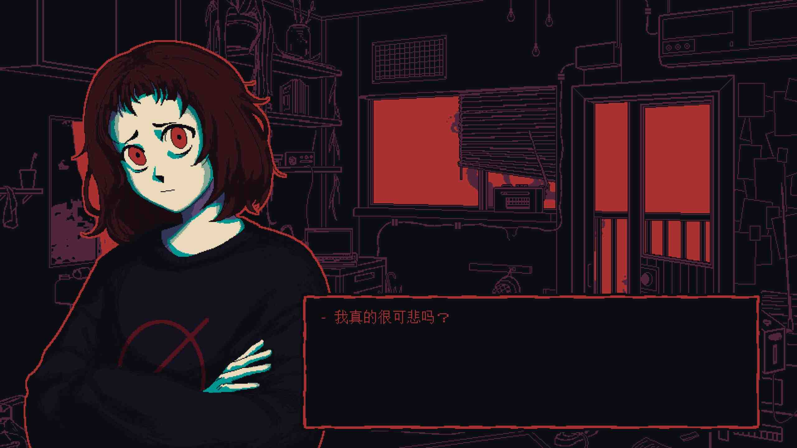
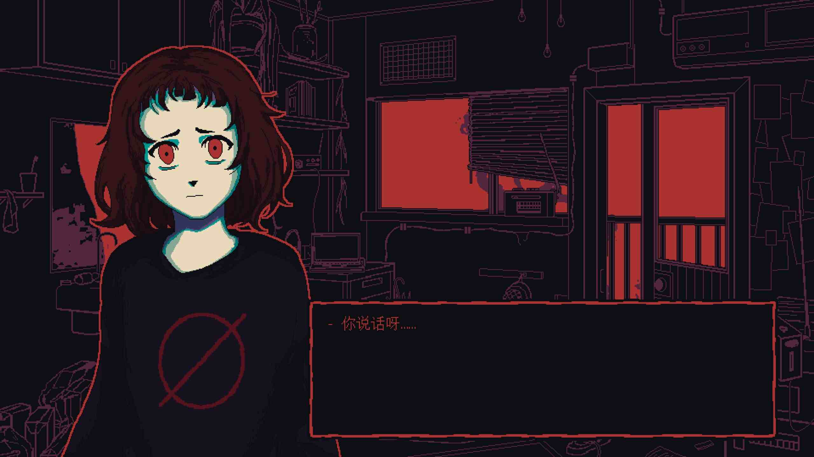
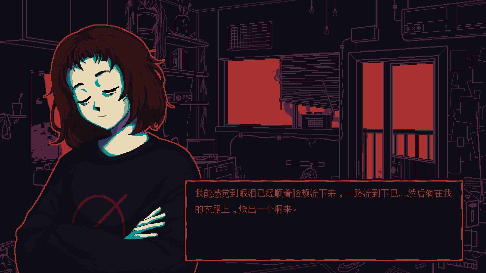

今天比完高中地奧的個人組複賽後，我到家裡附近的游泳池游泳。距離上次游泳已經過去了 39 天了，我當初還訂了每週七天游四天的目標，完全失敗。

我游了一個小時左右，準備離開游泳池。每個人都是直接一腳跨上泳池的邊緣離開，我每次做這個動作時都會遇到困難，尤其是像今天這樣很久沒有游過泳的情況。我試了第一次後失敗了，大腿內側傳來一次嚴正的抗議。我本來是想要穿越重重水道繩藉由泳池兩邊的梯子上岸的，但是一想到這樣看起來很遜、很蠢，我打消了這個念頭。

我的右腳踩上陸地，腳掌那邊一使力，我成功整個人翻上了岸；但是我發現我的腳掌回不到原位，而且腳踝那邊還痛得要死，沒錯，我抽筋了。

我就這樣看著我的右腳腳掌逐漸的左傾，我坐在泳池邊緣的排水溝上，站不起來。

我以前會一年到這個游泳池上一次一對二（和我弟一起）的課。如果第一堂課是我一年來第一次游泳，我的小腿每次都會抽筋，不過通常是在游泳的過程中。當時教練會幫我按摩，按摩之後情況就會好轉。

要命的是，我根本不記得抽筋要如何自救，我就坐在原地看著我的腳。我不太敢動它，生怕情況會更糟。

# 自省

我看著隔壁水道的陌生游泳教練，開始想：「如果我鼓起勇氣問他：『請問 ... 我腳踝抽筋了，應該要怎麼辦呢？』是不是這個困境就解決了？」

但是我做不到，我不知道是出於習慣還是什麼樣的原因，我只是坐著，看著我的右腳，什麼也不做，感覺著痛楚。

我這樣做的動機是什麼？我想到了一年前的經歷。

仔細回想，當初只是一個簡單的念頭在我心中萌芽：「如果我表現出心情不好、很痛苦的樣子，會有人來問我：『怎麼了嗎？』嗎？」。就這樣，我只是單純心情不好、很痛苦，但是從外表完全看不出來，也沒人來關心我，結果就是[這樣](https://tux24.xyz/articles/the-endless-loop)。

我沒有主動求助，看著另一個朝我走過來（還是應該說游過來？因為他人在水中。）的游泳教練。我們四目相接，「不知道他在想什麼？」我想著。「他會問我嗎？」，結果是沒有。

我就這樣坐了快十分鐘，直到情況好轉我才用很狼狽的姿勢站起來。我記得以前教練會叫我到熱水池去泡一泡；我今天也照做了，單腳跳到熱水池裡坐了十分鐘。

後來又發生了我被洗髮精瓶的蓋子刮傷手和因為忘了帶毛巾只好用換下來的髒衣服擦乾的事情，不過，我是不會被這些小事擊倒的。

_（我不會變成這樣。）_

_（第三張圖沒截好。）_

# 所以抽筋了到底要怎麼辦？

我剛才上網查了一下，[這篇文章](https://www.wikihow.com/Deal-with-Foot-Cramps)應該有用。

# 註解

寫到自省那段就寫不下去了。

我把抽筋的經歷寫成小作文，我真棒！