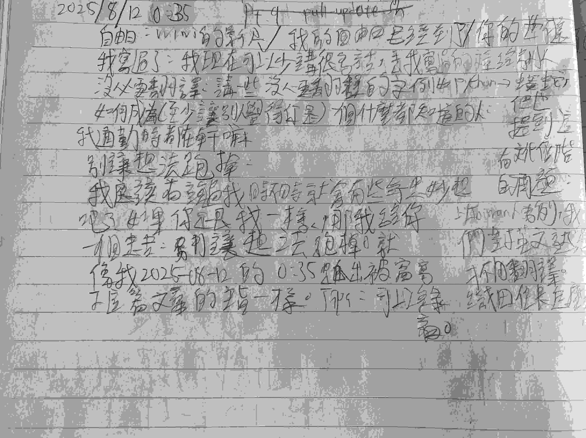

我應該有說過我時不時就會有些奇思妙想吧 ...？

不重要啦，如果你跟我一樣，以下是我的建議：

# 別讓想法溜走！

就像我在 2025-08-12 0:35 從被窩爬出來跑到工作桌前寫下這篇文章的主旨一樣：

_(字的美觀度不重要)_ 

_(有種預告的感覺)_

# 為什麼？

因為想法稍縱即逝，如果你不趕快抓住它的話，睡一覺大腦就幫你清到只剩下「重點」了；至於那些突然想到的詭異點子？抱歉，就跟夢境一樣，醒來三分鐘就忘了。

題外話：所以我也要同時建議你：把夢境紀錄下來。

# 怎麼做？

我建議你學習最近幾個月的我：隨身帶筆記本和鉛筆盒。我常常想到什麼東西就會寫下來，我的文章主題都是這樣來的，未來有機會我再跟你們分享。

然後，不要管別人，想到當下就寫。我之前會拿晚自習和上課的時間寫這些東西（在國中要小心別被發現，聽說[建中](https://tux24.xyz/articles/ck-math-summer-vacation-homework/)的老師都沒差），現在放暑假則是隨時都有機會可以寫。

你也可以在床頭放個錄音筆或是紙筆，這樣就不用跟我一樣跑出房間了，冬天可能會滿冷的。

# 不要浪費你家的筆記本

尤其是如果你跟我一樣家裡有很多的話，我這本定頁的用了四個多月都還沒寫滿。