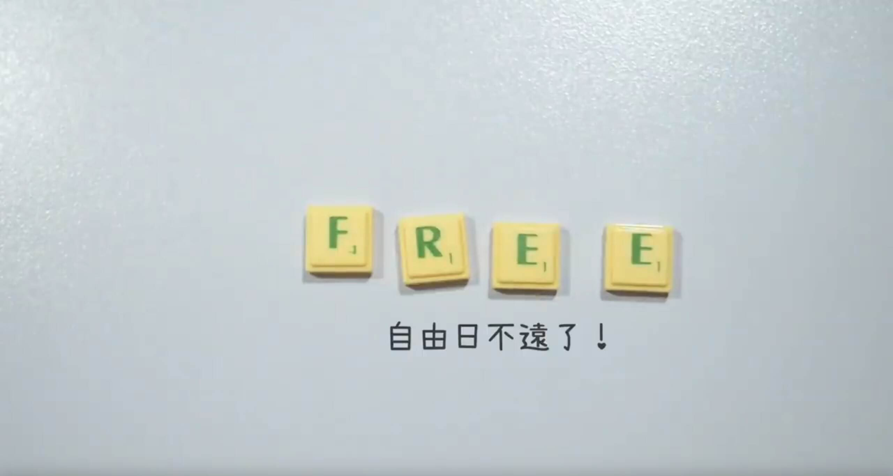

我記得我有說過，我是看了[這個影片](https://wiwi.video/w/vwyX6X8c3xPttYKrCCDkqv)才開始成為真．宅男的。其中 wiwi 在最後說到：

我至今還是把這句話深埋心中。

# wiwi 的自由日

我覺得 wiwi 的自由日指的是這個意思：

> 所有功能的軟體都有自由的方案，沒有人被技術問題強迫使用專有軟體來達成任何目的（例如說做音樂）。

以 2025 年 8 月來說，我覺得這個自由日已經幾乎到了（排除像我一樣被學校老師強迫使用不自由的軟體、檔案格式和雲端服務的例子），現在切換到自由軟體，除了[需要一點時間習慣](https://wiwi.blog/blog/horse-to-motorcycle)外，我不覺得還有非用專有軟體不可的情況。

問題在於：**大家不知道這件事！**

# 大家的自由日

那每個人的「自由日」是什麼呢？我覺得是這樣：

1. 你了解到現在[「正常」](https://tux24.xyz/articles/why-is-it-normal/)的網路環境有很多不應該的地方：沒有隱私、演算法操控思想、AI 和[機器人氾濫](https://wiwi.blog/blog/dead-internet-theory)、大家都被關在[高牆花園](https://pingukoala.blogspot.com/2013/12/walled-garden.html)裡 ... 等等。你對此感到不滿，並且會[**挺身而出反抗這個潮流**](https://wiwi.blog/blog/five-ages-of-humanity)。
2. 你知道什麼是**自由軟體**、專有軟體，並且傾向前者而非後者。
3. 你了解到 [DRM](https://wiwi.blog/blog/drm-doesnt-work)、封閉格式對於資料保存、使用體驗以及其他各種理由的不利，並且拒絕購買含有 DRM 的商品、使用[**開放格式**](https://tux24.xyz/articles/why-should-you-use-open-format/)。
4. 你知道數位韌性的重要，例如[**偏好離線而非串流**](https://tux24.xyz/articles/download-it-dont-stream-it/)。
5. 你了解到[**雲端就是別人的電腦**](https://wiwi.blog/blog/digital-prepping#%E4%BD%A0%E4%B8%8D%E9%9C%80%E8%A6%81%E9%9B%B2%E7%AB%AF)，你想要掌控自己的線上服務。
4. 還有更多 ...
4. 你會當一個好公民[^1]，主動關心以上有關**數位人權**的議題，並且付諸行動，例如 ... [架一個個人網站](https://tux24.xyz/articles/build-your-own-website-1/)！

# 我的自由日到了

以上面的標準來說，我的自由日算是到了。我寫的標準都是思想方面的，我覺得這比一開始就說[^2]：

> [Linux](https://wiwi.blog/blog/your-computer-is-not-yours)! [Linux](https://wiwi.blog/blog/your-computer-is-not-yours)! 

> 你怎麼還在用 iPhone！[^3]

> 不不不，不是 Word 能不能用的問題。 

還要好一點。

不不不，我不是說不要推坑這些東西。就像[「品味」](https://wiwi.blog/blog/taste)這篇文章寫的，**要先有品味（數位人權意識）才有追求技術的動力**，不然可能會變成[這樣](https://wiwi.blog/blog/horse-to-motorcycle)。我覺得要先自己意識到自由的重要，才會有內在的動力去追求，像我自己就是如此。而意識到了，並且想要擺脫這種情況的那天就是「自由日」了。

# 你的也不遠了！

讓我先恭喜你，你的自由日也不遠了！

為什麼？

**因為你正讀著一個超小眾、不[正常]()的個人 Blog 啊！**

既然你都在讀這個網站而非社群媒體了，那你想必也不是泛泛之輩。看完這邊如果意猶未盡也去造訪[其他已經自由的人的個人網站](https://wiwi.blog/blog/content-gold-ratio)吧。

[^1]: 我覺得這種說法有點討厭，好像在綁架讀者。但我是同意這個觀點的
[^2]: 我覺得我以前的推坑方式有點問題
[^3]: 對不起