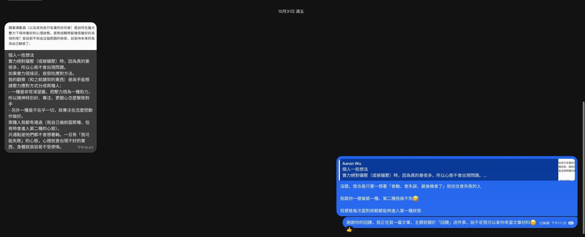

本文的靈感來自[雷歐的這篇文章](https://revolc.blog/posts/practicing-giving-feedback/)，然後我也是因此才知道[只贏](https://onlywin.substack.com/)的，謝謝你們兩個。

---

自從 [Wiwi.blog 的部落卷](https://wiwi.blog/blogroll)橫空出世之後，我收到了好多好多 E-mail，其中不乏鼓勵和對我文章的討論，我剛開始很興奮的回覆大家的信件，整個八月都沉浸在「被看見了！」的喜悅之中，但後來我開始覺得好像哪裡不對。

會發現問題的契機是我開學後回信的間隔越拖越長，有寫信給我的人就知道了，真的很長，長到超越「現在」這個時間點[^1]。如此一來我才意識到：「**我在信件中總是顧著談論我自己**」。

這種不對等的關係總有一天會造成沒人想和我筆談，因為這傢伙總是不給出回饋，只知道流於空泛的讚美言語。我開始有危機感了。

其實我一直都在密切關注我的 RSS Feed，寄來的信我也都讀過了，照理來說應該不缺回饋的材料才對，我覺得這和我習慣了使用即時通訊軟體簡短、急促、片面的回覆方式有關。最近有讀者加了我的 Signal 跟我聊天，我（大部分時間）都能馬上回覆他，這讓我開始覺得是自己給自己太多壓力了，認為回信就是要力求完整、通順、好讀（雖然的確如此沒錯），才寫不出半個字來。

可是回饋很重要，不只是形成良性、對等的關係，更重要的是讓他人感受到我感受過的那種喜悅，讓他人知道有人正在看著自己、有人關心自己、有人為了自己每天打開 RSS Reader。我有必要寫、我有必要回饋。

> 在網路上，負面的聲音特別大聲，而支持的人常常只是在心裡默默認同，這也導致我們誤以為世界上幾乎都是酸民。

> **因此，如果你有喜歡的創作者，應該多回饋讓他們知道。**

沒錯，如果你以後看到了我的來信或是我開始在這裡寫文章，開頭是：「本文靈感來自 ...」，那是我正在練習回饋，我想讓你知道有個~~寶貴的~~真人讀者正在支持你，只是他不甘沉默。

從今天開始，回饋你喜歡的人吧，不管是否認識。寫信、發文或是私訊他，讓他知道他被看見了。

---

p.s. 我好久才發一次文，沒想到馬上就有線下的朋友給我回饋，太感動了🥹

p.p.s. Jaron 今天（2025-11-02）整理了[曾經提及過他的文章列表](https://www.jaron.tw/docs/fun/mentioned/)，可以算是對於別人回饋的回饋，滿有趣的點子，但我覺得做起來應該頗麻煩。[^2]

[^1]: 白話翻譯：有些信我到現在放了一個月以上都還沒回，其中甚至有我線下的朋友💀

[^2]: 這算不算是對於回饋的回饋的回饋？
