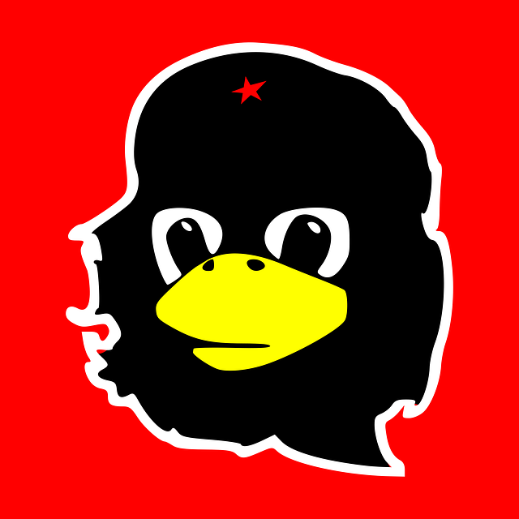
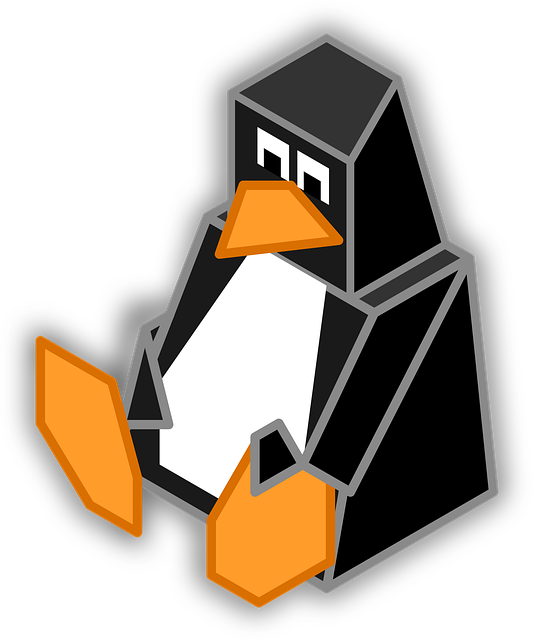
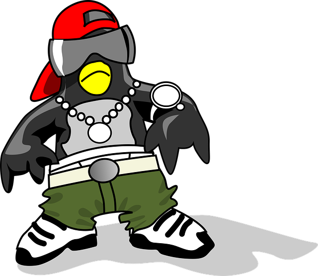

雖然主頁那隻企鵝（維基百科上抓來的）繼續放在那裡應該也不會有版權或是企鵝權的問題，但是我想要一張有**特色**的圖片。

所以我決定直接問我的讀者中有沒有會畫企鵝的人。

我的具體要求和我能給出的報酬如下：

* 🐧圖片要求：我需要一張圓形的圖片（或許方形的也行，我會裁切成圓的），內容就是一隻企鵝，不過品種是 ... 我不知道，反正你就參考 [Linux Tux](https://zh.wikipedia.org/wiki/Tux) 的圖片畫，我下面會放一些別人二創 Tux 的範例圖片。顏色不拘、企鵝的表情、動作、姿勢也不拘（不要 NSFW）。發揮你的創意吧。你也可以把你對我的印象畫進去（因為你應該是線下認識我的人，請見下文）。

* 💸報酬：我會付你 NT 300 一張圖（我只要**一張**），你知道我目前沒什麼錢。

* ❔如何接案：請你先看 [`/contact`](https://tux24.xyz/contact) 聯絡我，我會去看你過去畫過什麼東西再決定要不要僱用你，並且給你比上面的圖片要求再更詳細一點的要求（根據你過去的風格），我會盡量不要寫太多。如果我沒有僱用你而你為我畫了一張（很棒的[^1]）圖，我可能會免費拿去用，除非你是我朋友。

* 💸我如何付你錢：我目前只能用現金付款，所以你必須是我線下認識的人才行🥲

* ❕重要備註：你可以在圖片的角落簽名宣傳你自己沒有問題。案子完成後我會把你的名字和個人網站（如果你有的話）放在修改後的這篇文章開頭，可以算是幫你宣傳。

* 很重要的一點：
* 請不要
* 使用
* 任何 AI 模型
* 生成
* 圖片

以下是我剛才提到的範例圖片

我的網站目前用的圖片，維基百科抓來的：

像這個還滿有創意的，不畫出全身我也 OK：

這個也不錯，不過不要切格瓦拉拜託：

還行：

你知道我在日常生活中不是這個形象：

[^1]: 我不喜歡的話就不會理你