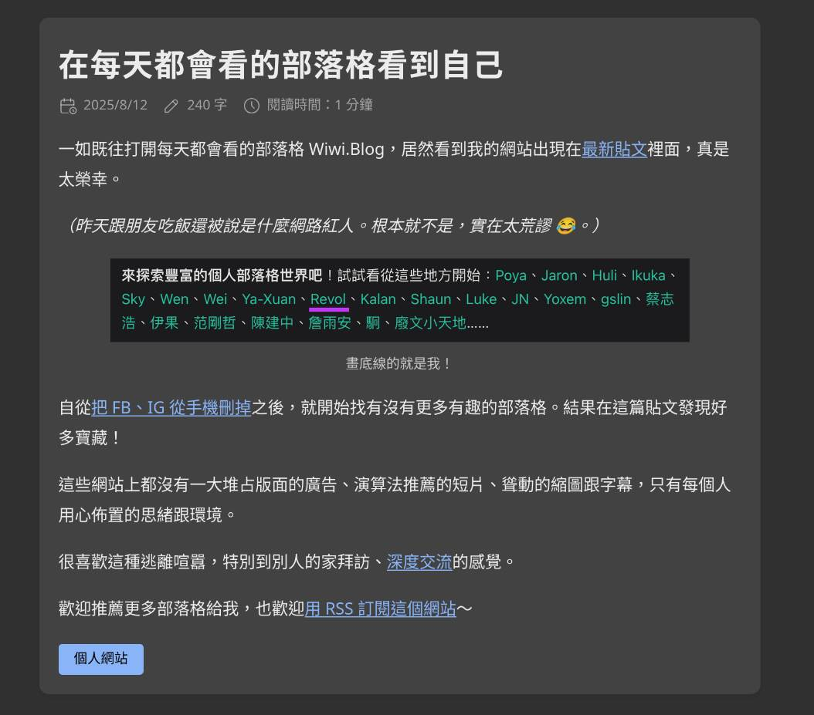

我把那個原本很長的文章標題換掉了。

# [wiwi 的 `/links` 要來了！](https://wiwi.blog/blog/content-gold-ratio)

會有我嗎？！

# 我從那篇文章找到了很多有趣的個人網站🥹 ...

題外話：我以前曾經發現一個[超多有趣個人網站的集合](https://github.com/LukeSmithxyz/based.cooking/tree/master/data/authors)，我當時有貼在 [nicelink.me](https://nicelink.me) 上。其實就是 [based.cooking](https://based.cooking) 的作者清單啦。

其中有一篇這麼寫：

[原文](https://revolc.blog/posts/appear-in-wiwi-blog/)

好像有不少人也是被 wiwi.blog 影響了欸。我自己的話，要不是有 wiwi 以前的[好檸檬 Podcast](https://nicelemon.libsyn.com/)，根本不會有今天。

但我最近也意識到我的文章好像引用太多 wiwi.blog 的文章了，而原因就是我沒有看過其他有趣的個人網站😢。我應該要多引用自己的文章的，所以我現在寫了這篇廢文，誰知道它未來會不會造成什麼[黑天鵝效應](https://tux24.xyz/articles/monika-and-taleb/)？

# 至於我的 [`/links`](https://tux24.xyz/links) ...

好啦，我會寫的。

我覺得 [`/links`](https://tux24.xyz/links) 的重要性不次於 [`/use`](https://tux24.xyz/use)、[`/about`](https://tux24.xyz/about) 和 [`/now`](https://tux24.xyz/now)，因為優質 [`/links`](https://tux24.xyz/links) 越多、抓住[機會窗口](https://tux24.xyz/articles/monika-and-taleb/)的可能性越高（你數數這句話有幾個連結？）。

# 還有信要寫

我已經把這些個人網站都加到我的 [RSS](https://wiwi.blog/blog/you-should-use-rss) 清單了，可是我還沒把大家的文章讀完。

我還要寫信給[雷歐](https://revolc.blog/)跟他分享這篇文章 ...