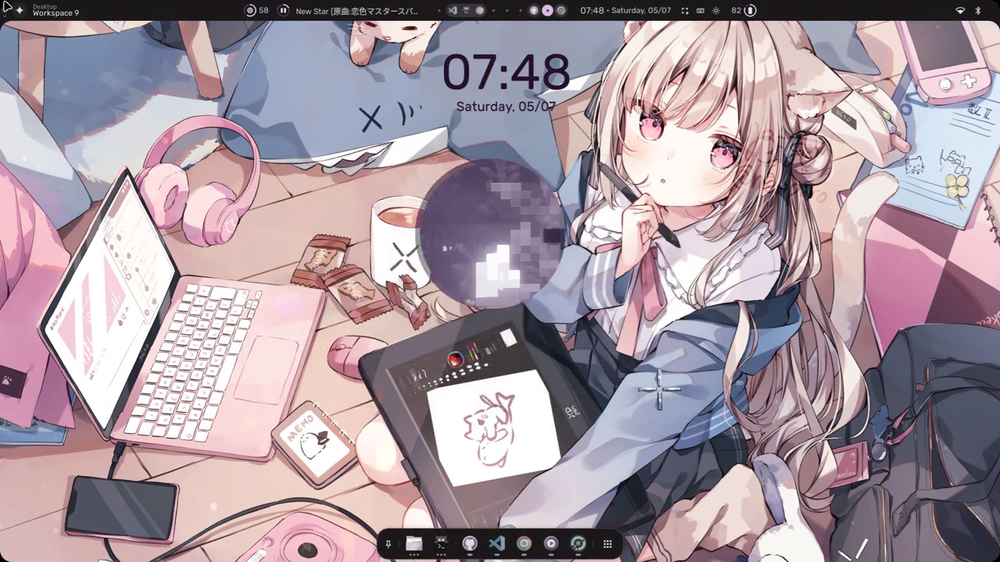
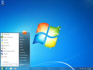

# 前言

我當然已經沒有我小學三年級時的資訊科技（當時大家都叫它電腦課）課本了，所以很抱歉，本文將沒有課本上的圖片。以下內容都是根據我的回憶。

# 課堂上在幹嘛？

我記得老師會先教學生要如何打字，內容包括：兩隻食指要放在 F&J 鍵上、各手指分配到的打字範圍 … 沒了，但那對當時的我來說是新東西，在此之前我應該都只用兩隻手指來打字。

接下來應該就是 Windows 7 系統的基本操作吧，包含要怎麼關機之類的，當然，這些我早就會了。

然後是 Word、Powerpoint 等專有軟體的操作教學，微軟客戶從小學三年級開始培養，真快。

比較印象深刻的是，課堂上還有  [PhotoCap](https://zh.wikipedia.org/wiki/PhotoCap) 這個軟體的教學，課本上也有相關內容。從維基百科上的資訊看來，這軟體已經死掉了？[^1]
[^1]: 上次更新是 2012 年，而且它的官網不在了，變成一個 WordPress 的示範頁面。

此軟體是一個台灣人開發的 ... 免費專有軟體，學校把它當成小學三年級資訊科技課的教學工具非常荒謬，先不論這個[技能的可轉移性](https://wiwi.blog/blog/transferable-skills#%E9%80%99%E8%A3%A1%E9%BB%9E%E9%BB%9E%E9%82%A3%E8%A3%A1%E6%BB%91%E6%BB%91%E7%9A%84%E6%8A%80%E8%83%BD)有多低，學校是希望我們未來變成這些專有軟體的忠實使用者嗎 ...

# 課本上寫了什麼？

我記得課本上在介紹 Windows 系統時有稍微提到另外兩個作業系統（好啦我知道有一個不算，但課本當時是這麼教我們的），我是說 Mac OS 和 Linux。我印象深刻，三個作業系統被放在頁面的右下角一起比較，有三張桌面的截圖，和底下簡短的文字說明。課本為 Linux 挑選的圖片是 MX Linux 的截圖，我還記得背景圖片是一隻蜻蜓。

這是個錯誤！如果當時課本放的圖片像是[我剛才到 r/unixporn 隨手抓下來的這張截圖](https://www.reddit.com/r/unixporn/comments/1ls4xdv/hyprland_my_virginity_defense_ft_quickshell/)的話**我（可能還有我同學）的人生會整個改變欸！**你能想像一下這張圖片和 Windows 7 那張預設的圖片擺在一起的樣子嗎？

我是開玩笑的 … 🥲

