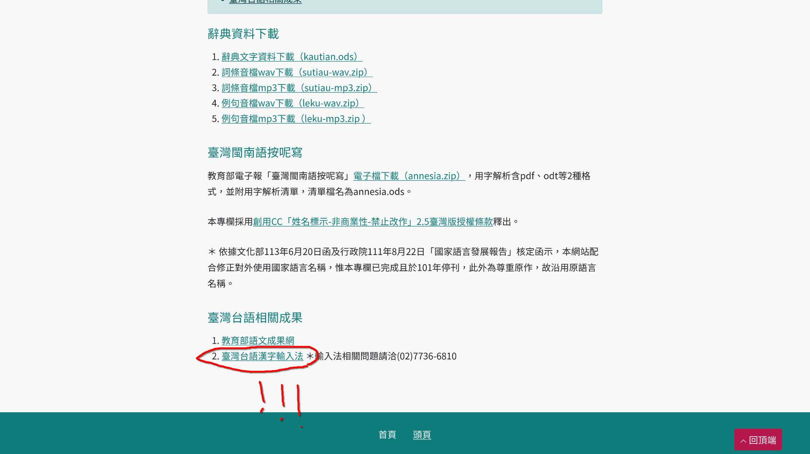
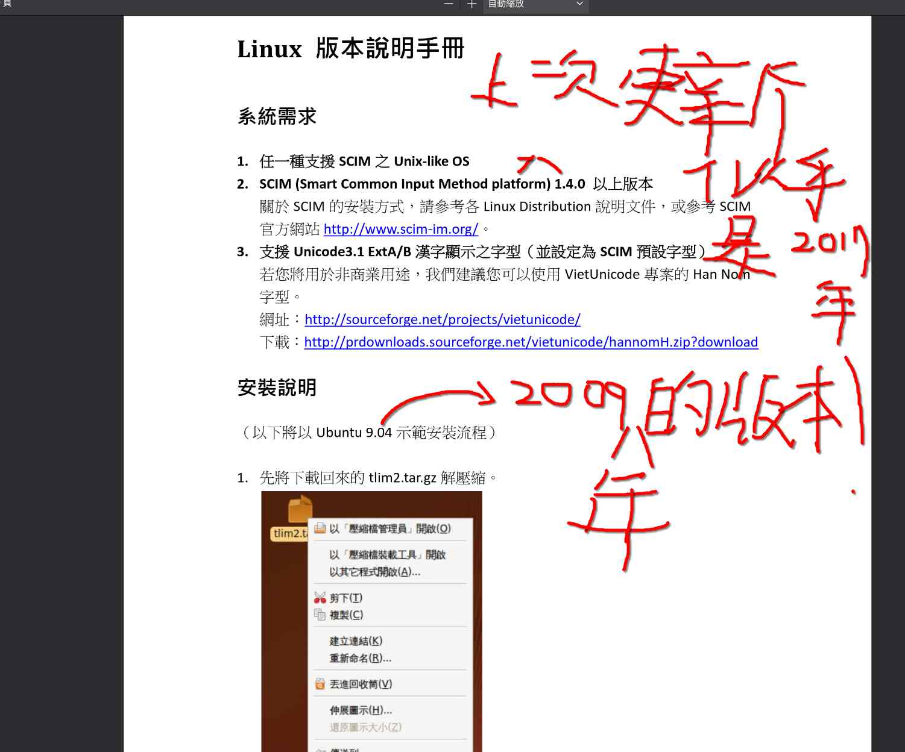
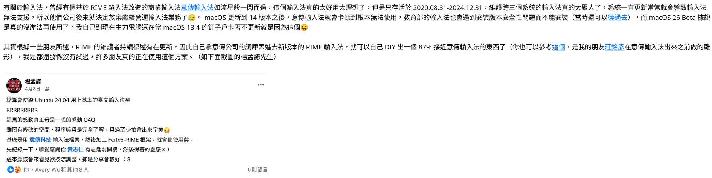
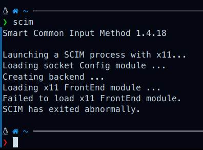

前幾天收到[陳建中](https://kiantiong.com)的讀者來信，想起以前在教典有看過教育部開發的台語輸入法，我小學時的台語老師也有在使用，於是去找了一下看它還在不在。

沒想到，不只還在，竟然有 Linux 版！

# 可是 ...

我馬上打開說明手冊[^1]，但 ...

這說明手冊有點舊了啊，好像是 2010 年（我出生那年）寫的。而且裡面提到的 SCIM 似乎停更很久欸 ...

我有把這件事寫在我寄給陳建中的信裡：

他是這樣回覆我的：

_（字太小抱歉，下次會改善）_

# 測試：失敗

還是試試看吧，我這樣想。我照著說明手冊一步步安裝輸入法，但看來不可能成功：

我已經全面改用 Wayland 了，所以 SCIM 沒辦法正常啟動。

我接著試著使用[這個方案](https://github.com/glll4678/rime-taigi)，同樣的很久沒更新了，而且不清楚這東西和 Wayland 的相容性如何。因為牽扯到我不熟的 ibus，我照著有點簡短的這個 README.md 安裝輸入法，但是我切換到 ibus 之後台語輸入法並未出現。好吧，也可能是我的問題。

我認為目前來說最好的是「意傳輸入法的詞庫 + Fcitx5-RIME」這個方案，已經有成功案例了。Fcitx5-RIME 到目前還有完整的支援（我測試了，拼音正常運作），我目前使用的新酷音也是搭配 Fcitx5。

但是意傳輸入法是專有的，我沒有詞庫，沒辦法用上😢

# 結論

Linux 下的台語輸入法現況不太妙，如果 ibus + RIME 的那個方案能成功運作，並且在之後可以改到 Fcitx5-Rime 上運行就太棒了。目前想用的話可能只能用意傳輸入法 DIY，Ubuntu 24.04 用的是 GNOME 46，GNOME 46 用的是 Wayland，既然可以運作那就代表 ...？

[^1]: 我把說明手冊[放這](https://language.moe.gov.tw/files/people_files/blgsujip%201131108.pdf)。