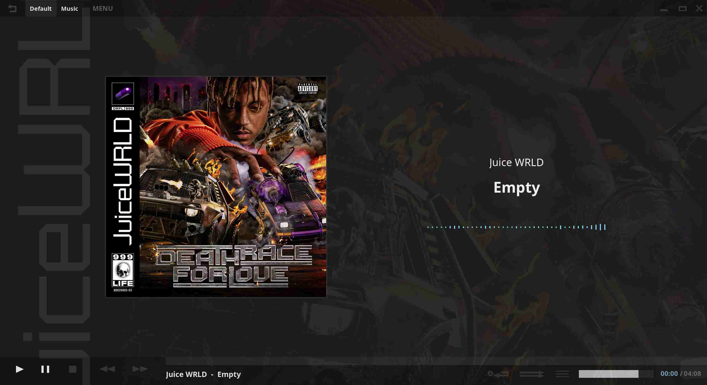
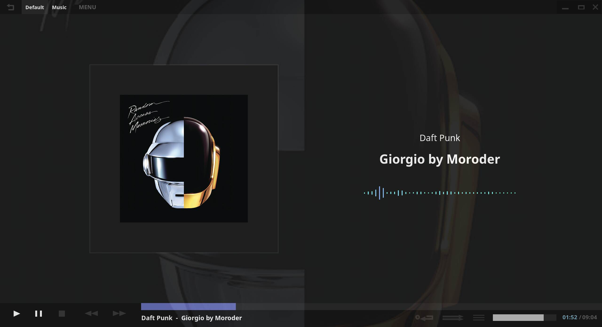
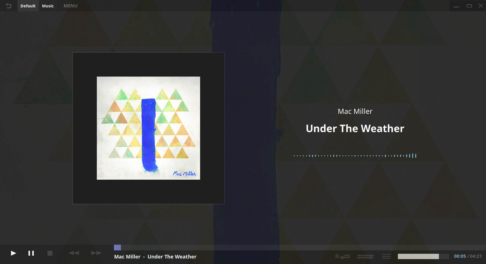
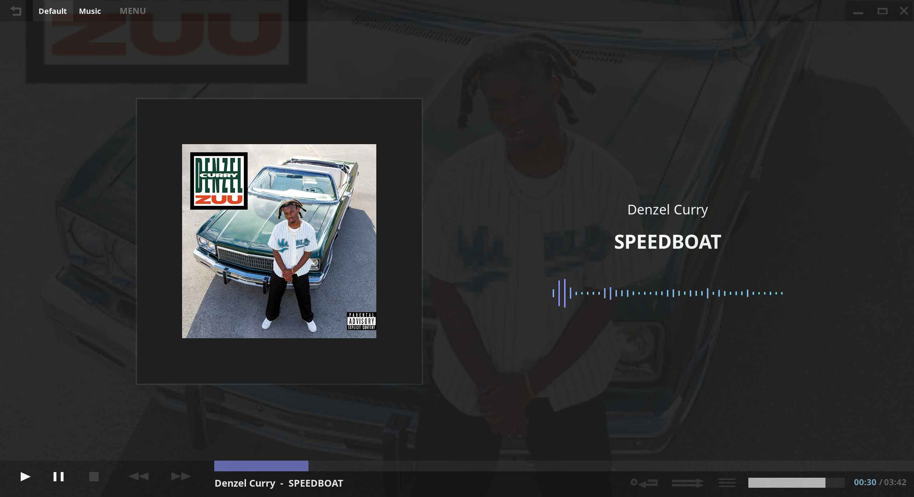
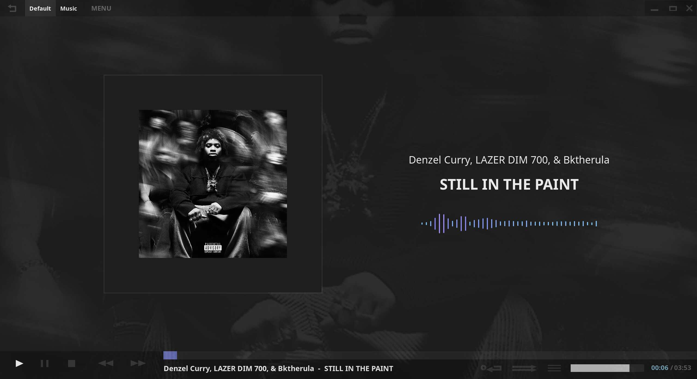
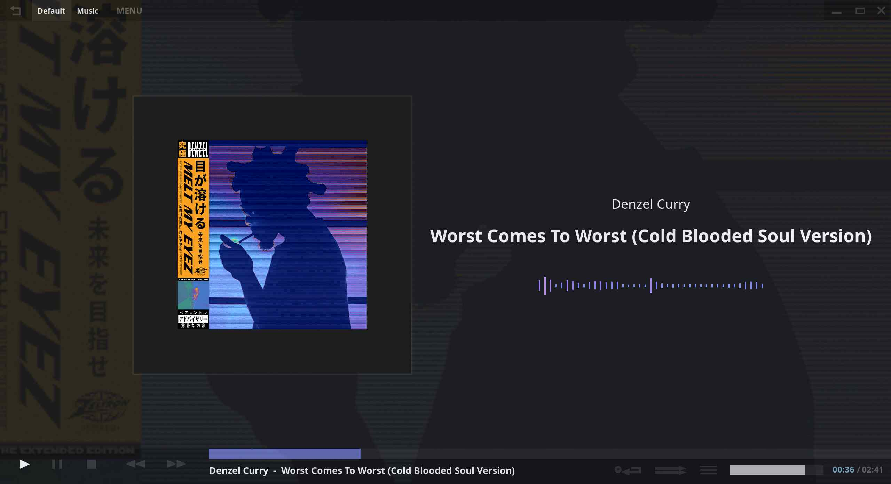
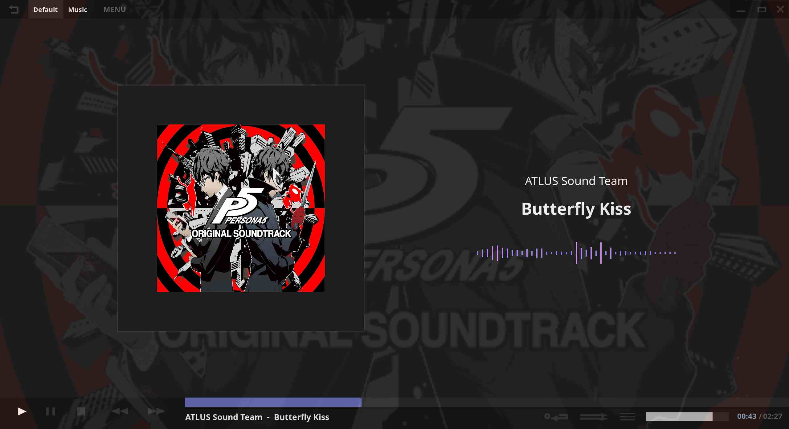
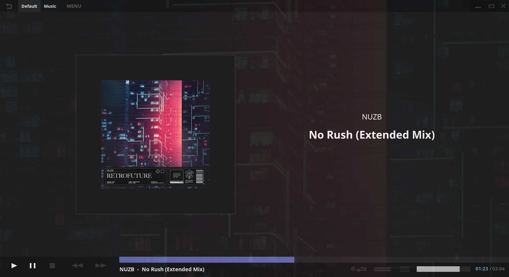

我讀到了[駉](https://alexhsu.com/zh)的[這篇文章](https://alexhsu.com/zh/fuck-algorithms/)。看來大家都[清醒](https://tux24.xyz/articles/download-it-dont-stream-it/)了啊。

最近一年多我開始用「專輯」的方式聽音樂，我對專輯中曲目的編排、封面的選擇、插曲 ... 等等和單首曲目比較無關的要素開始感到有趣，也藉此探索到了原本陌生的音樂流派[^1]。比較可惜的是，我聽的 DJ 現場表演變少了，這對不愛發行專輯的一些電子樂製作人似乎不太「公平」。

以下是我最近反覆播放的幾張專輯，我其實會寫在 [`/now`](https://tux24.xyz/now) 啦，但那邊的版面不太夠我寫🤣。我不照順序排列，會附上極短的評論：

* Currents - 神作中的神作

* Death Race For Love - 72 分鐘會太長嗎？我覺得很完美

* Random Access Memory - My name is ... 

* Blue Slide Park - 朋友推薦我聽 Mac Miller，不過一個月過去只聽了一張專輯

* ZUU - 29 分鐘會太短嗎？我覺得很完美

* KING OF THE MISCHIEVOUS SOUTH - 加長版的聆聽體驗才完整，但是我比較喜歡原本的封面

* Melt My Eyez See Your Future (Extended Version) - 加長版多了 Cold Blooded Soul Version 的曲目，封面也比原本的帥

* [新しい日の誕生](https://tux24.xyz/articles/birth-of-new-day/) - 我寫過了

* PERSONA5 ORIGINAL SOUNDTRACK - 兩年過去，目前仍然是我的最愛遊戲原聲帶

* Greatest Hits Vol. 1 - 聽了心情會變好

* RetroFuture - 太短了，希望 NUZB 能出張專輯，不過不太可能🥲

[^1]: 會聽專輯還有一個原因：CD 比較好買