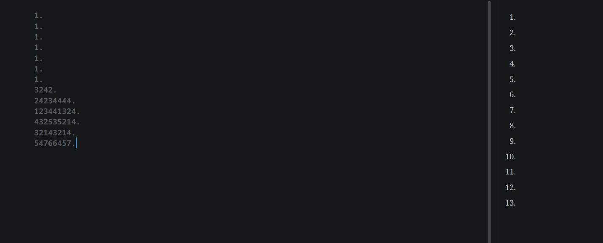

# 魔法 1

給你們看看我[這篇文章](https://tux24.xyz/articles/why-is-it-normal)的原始碼：

和渲染後的結果：

看到沒，雖然我的腳註是想到什麼寫什麼，完全不照順序，但是 Markdown 就是會幫我自動排好！這就是 Markdown 的魔法！

# 魔法 2

讓我再舉一個例子：

雖然我的數字完全亂打，但是 Markdown 就是會幫我自動排好！這就是 Markdown 的魔法！

# 趕快來用 Markdown 吧！

Markdown 的優點其實不只這些，我認為**所有**想要用電腦寫**任何東西**的人都應該學習 Markdown 這個非常容易上手的標記語言。

不像 LaTex 或 HTML 有很多像是咒語的東西：

_(LaTex 和 HTML。有很多像是咒語的東西。)_

Markdown 只要花你 30 分鐘就可以學會。

我的架網站教學[^1]會用到的 Hugo 其實就是一個可以讓你用 Markdown 生成網頁的工具，很方便對吧？還不快入坑 Markdown？

_（想開始用 Markdown 寫作的人可以參考[我現在用的這個編輯器](https://tux24.xyz/articles/ghostwriter)）_

[^1]: 對我知道我停更好幾天了，這不就來水文章了嗎？