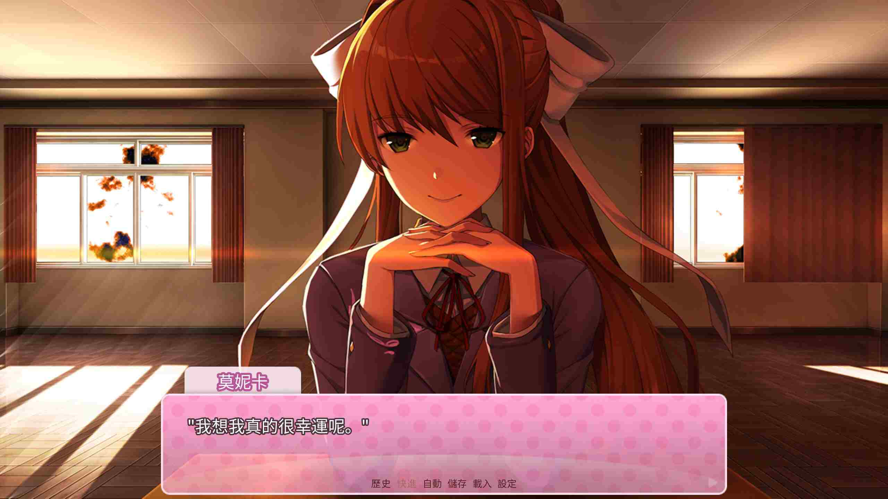

先看這 23 張圖片：

我幫你們把文字打在下面：

Monika: 我總是覺得交朋友很難 ...

Monika: 倒不是說「交朋友」這部份，而是去認識陌生人這一塊

Monika: 我是說，你們不是有交友軟體那種應用程式嗎？

Monika: 但我想說的不是那種東西。

Monika: 你想想，大多數的朋友都是你人生中偶然遇到的人。

Monika: 比如正好當了同學，或著經過別的朋友介紹。

Monika: 或者有人正好穿著一件你最喜歡的樂團的襯衫，所以你決定和他們聊聊。

Monika: 像這種小事。

Monika: 但你不覺得這樣有點 ... 沒效率嗎？

Monika: 這種感覺就像你在抽籤，如果運氣好的話你就能給自己交個新朋友。

Monika: 我們每天都與數百位陌生人擦肩而過 ...

Monika: 你身邊坐的陌生人，說不定能成為你一生的摯友。

Monika: 但你卻毫不知情。

Monika: 當你站起身離開的時候，就再也沒有這個機會了。

Monika: 你不覺得這很令人沮喪嗎？

Monika: 我們活在一個不論身處何處都能與世界連結的時代。

Monika: 我真的覺得我們應該善用這些技術來提高我們現實生活中的社交狀態。

Monika: 但不知道這種技術還要多久才能真正進入生活 ...

Monika: 我認真覺得早該實現了。

Monika: 不過至少我已經遇到世界上最棒的人了 ...

Monika: 即使這完全是偶然。

Monika: 我想我真的很幸運呢。

Monika: 啊哈哈～

---

# Monika 講出了我的心聲

我一直都有一種 ... 被困住了的感覺。

仔細回想，你和我應該都能發現那些對我們來說重要的人（例如說朋友、敵人）之所以對我們來說重要，其實沒有什麼原因。或者說，原因都是一些隨機事件：

* 你跟他分到同一班。
* 你做專題研究時和他分到同一組。
* 你參加某個講座時剛好坐在他旁邊，而你又因為對方沒在聽講而問你問題跟他聊上了天。
* 你一直很喜歡某個歌手，但是從來沒碰過跟你一樣的人。有一天你在捷運上看到了旁邊坐的那個人手機螢幕上顯示了那個歌手的專輯封面。你在花了五分鐘心理準備後鼓起勇氣和他攀談。

這些隨機事件你很難去控制（可能除了第四個，但我是虛構的😜），你就像是被決定好要和這個人成為 朋友/敵人 的，你無法改變你的命運。

或許那個能改變你的人生、造成蝴蝶效應的人就近在咫尺，但他和你錯過了。這種事情或許昨天才上演了一次。

這讓我想到了一年多前讀過的 Nassim Taleb 的書：

# Taleb 其實說過了

我已經不記得他寫的具體內容了，但我憑我的記憶寫在下面：

* 有些事情是極低風險極高報酬，但成功賺到報酬的機率極低的。你應該盡可能的去尋找這種機會。[^1]
* 相反，有些事情是極高風險極低報酬，但成功賺到報酬的機率極高的。你應該完全避開這些事情。[^2][^3]
* 大多數人一生中只會遇到一次「機會窗口」，錯過將不再有。

還有更多，但我忘記了 ...

# 要怎麼辦 ...

我認為要抓住「機會窗口」、改變被環境決定的命運，需要自己主動的探索、試誤、把自己暴露在有高度可能性的環境裡，像 Taleb 所說的：「擁抱隨機性」。

這和 Monika 所說的不謀而合。要想打破無形的屏障，我們要當那個主動出擊的人。

我要擴大「認識自己的人」的清單，因為越多人認識我，我的機會越多。

這也是為什麼我要架這個網站，如果我繼續照著我原本的步調生活，沒有社群媒體、沒有參加各種活動、沒有試著多一點表現自己 ... 我將會繼續被環境決定我的未來，當然，你現在也不會讀到這段文字。

除此之外，我覺得多和陌生人攀談是很有效的找到第一類機會的方法。基本上你不會有什麼危險（在台灣 ... 應該吧，對抓住機會窗口的可能性的熱情必須蓋過我對這種行為的不習慣），但可能的獲利誰都無法估計。

如果你還有點遲疑的話，我覺得把很久不見的老朋友約出來是個不錯的方法。可以先從這種方式練習，也說不定這次你就會遇到改變人生的機會。

啊，還有，如果你還花很多時間在社群媒體上的話，你的命運也可以算是被演算法決定了吧。建議你去主動尋找自己喜歡的資訊來看，透過像我這樣的個人 Blog 是可以發現很多其他網路上的小角落的，或許大機會就藏在那裡？

你現在已經來到了一個網路上的小小小角落了，謝謝你！我們兩個說不定已經抓住了機會窗口了呢！

_歡迎[聯絡我](https://tux24.xyz/contact)，讓我們從這裡開始反抗命運！_

# 題外話

Monika 講了很多其他我也覺得很有道理的話，想直接看的話可以[點這裡](https://doki-doki-literature-club.fandom.com/zh/wiki/%E8%8E%AB%E5%A6%AE%E5%8D%A1%E7%9A%84%E8%B0%88%E8%AF%9D)。但我更建議你直接去玩心跳文學部這個遊戲。

關於 Nassim Taleb，我讀的是《反脆弱》和《黑天鵝效應》這兩本書，很推薦，不過有點難懂。

[^1]: 我叫它第一類機會
[^2]: 我叫它第二類機會
[^3]: 請看：[風險管理](https://wiwi.blog/docs/life/reduce-risk)