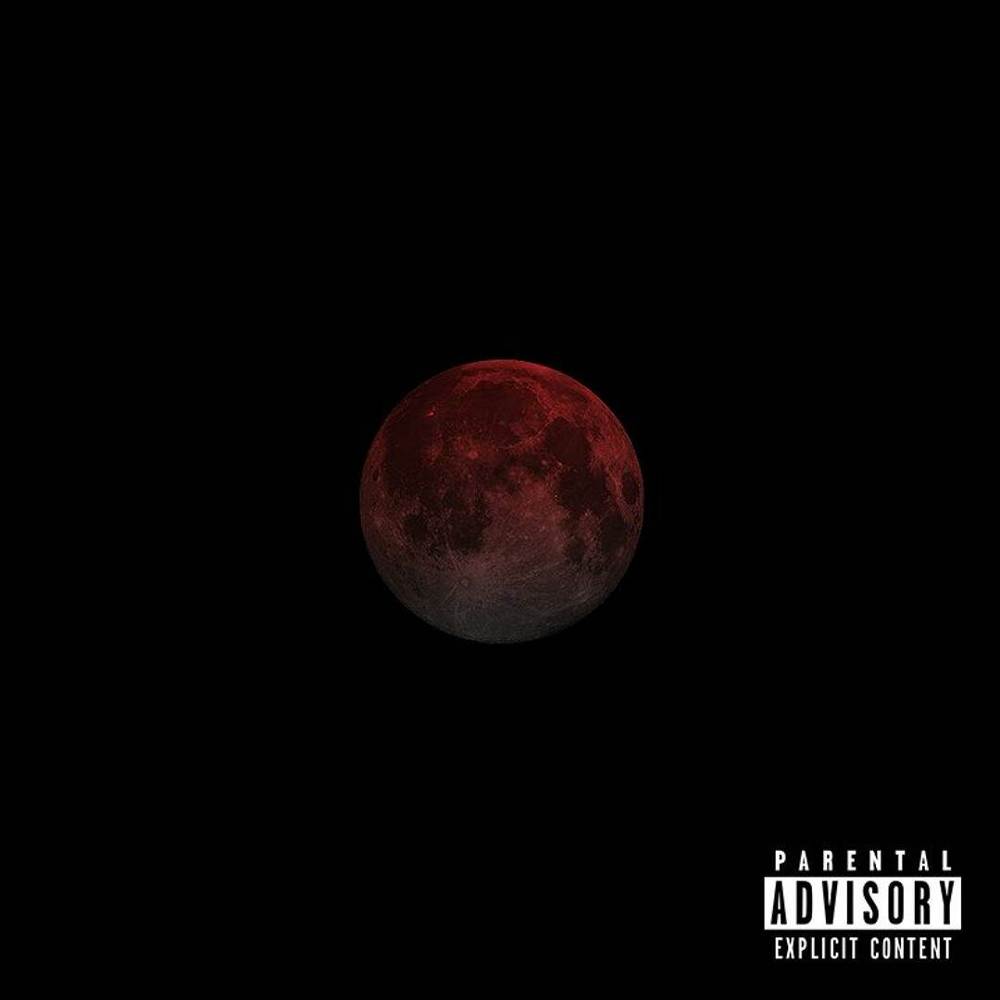

2025-09-06 是中元節，也就是農曆的七月十五，是滿月的日子，所以最近幾天的月光特別亮。

我睡前坐在床上時發現到窗簾和窗戶下緣中的縫隙透出了一點光，我原先以為是有人開了陽台[^1]的燈，所以我撥開窗簾一探究竟。不如我的預想，並沒有人開燈，我抬頭一看，光的來源不是任何燈泡，是月光。

我把我的手放到月光下，手上的那片白班是從月亮來的。我從來不覺得月光有多麼亮，它充其量只是存在，月光的亮度對我們沒什麼影響，現在我知道我錯了。我們習慣了在晚上使用燈泡作為照明，沒注意到月光，但月光一直都在那[^2]，「真實存在」... 說得好像它原本是什麼原本不屬於這世界的東西一樣。

雖然沒什麼關係但還是放首歌：

[Soundcloud 連結](https://soundcloud.com/uiceheidd/moonlight)

[^1]: 我的房間離我家陽台特別近，如果有人開了燈我就會知道
[^2]: 準確來說不是「一直」