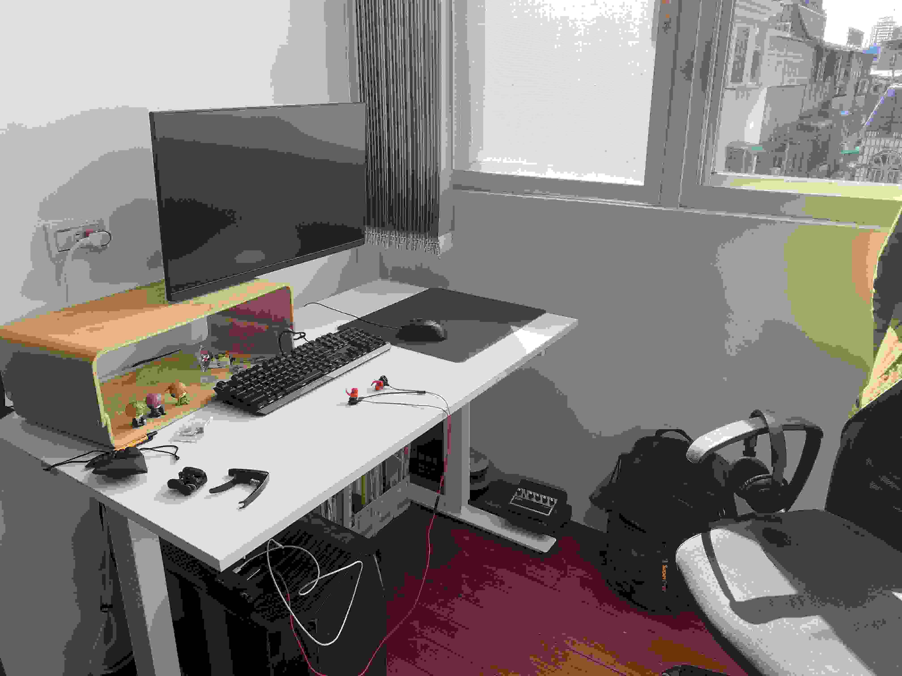
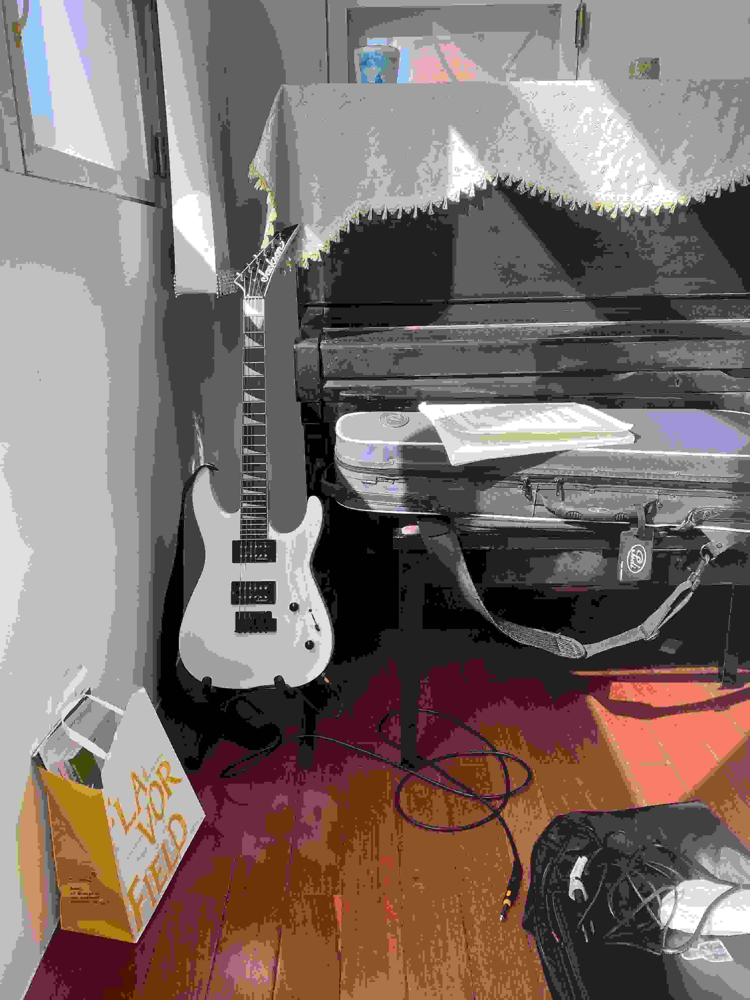

今天臨時起意就想要拍一下我平時的工作的環境。我 80% 的文章都是在這裡寫的。最近幾個月聽的音樂大概有一半也是坐在這個位置上聽的。

我會一直保持我的工作桌乾淨，而其他地方就不管，所以沒拍到的地方都是十分的 ... 混亂且有機。

我大概是在 2024 年初的時候搬到這邊。
因為我家太小了，那時候我想要一個獨立的位置讓我可以工作，但是我沒有自己的房間，所以我只好搬到一個還可以的小角落。

這個小角落就在我家客廳的旁邊，可以說沒有任何隱私，非常容易被打擾，只要客廳有人，我做什麼都會被注意到。

還有一個很嚴重的問題是白天旁邊窗外的陽光（尤其是下午）會打在我的螢幕上反光，很難看得清楚。

晚上的時候我頭頂的燈也不夠亮，一樣看不太清楚。

既然我忍受了這麼多的小小的[不舒服](https://wiwi.blog/blog/tiny-discomforts/)，看來我也是自由的。

---

你可以想像我坐在這邊聽《[新しい日の誕生](https://tux24.xyz/articles/birth-of-new-day/)》然後想像自己在東亞未來風賽博龐克霓虹燈人很多大城市的感覺。

嗯 ...