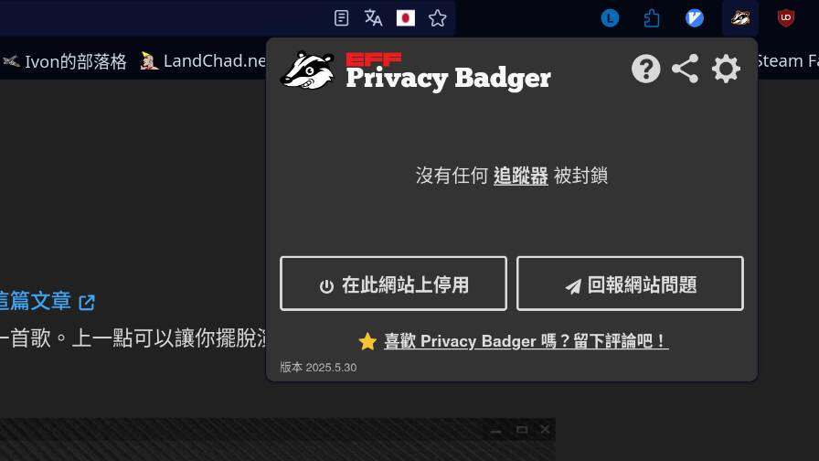

我今天在思考我要如何得知這個網站有多少人看、大家看最多的是哪篇文章、大家人都在哪 ... 等等的問題。

先說結論好了，我的結論是：

# The Less I Know The Better

_(沒錯，我用了[這篇文章](https://tux24.xyz/articles/a-few-advices-for-time-saving/#%e9%9f%b3%e6%a8%82%e9%a1%9e)裡的同一張圖片[^2])_

為什麼我需要知道這些啊？

知道這些對我有什麼幫助？

好吧，我承認，如果這是個商品銷售網頁的話可能是真的滿有幫助的，但這裡不是。

這是我的個人網站，我放的只有我自己寫的文章，沒了。如果我透過了追蹤器知道了這些有的沒的統計數據，我只是為了偶然的好奇心犧牲了你們的隱私。

我知道使用者可以自己擋掉這些追蹤器和 JavaScript，但是那不是重點。我有經驗，我知道總是有沒辦法擋掉追蹤器的情況；如果我在自己的網站放了追蹤器再呼籲讀者使用像是 [NoScript](https://noscript.net/)、[Privacy Badger](https://privacybadger.org/) 和 [uBlock Origin](https://ublockorigin.com/) 這樣的工具，我覺得這是一種偽善。

這樣做除了滿足我的好奇心以外，可能還會帶給我罪惡感吧。違背價值觀的事情我是不做的。況且沒有追蹤器和 JavaScript 的網站不是比較 [Based](https://tux24.xyz/articles/based) 嗎？

[^1]: 所以我沒有做站內搜尋功能，但是你可以自己用別的方法達到同樣的效果（不跟你說🤫）。
# 我的網站尊重你

你可以檢查，我的網站真的沒有任何追蹤器或 JavaScript[^1]：

想知道如何反抗不尊重你的網站嗎？請讀：[這篇文章](https://wiwi.blog/blog/websites-that-disrespect-you)。

# 滿足我的好奇心吧！

但我的好奇心 ... 還在啊！如果你從來沒有聯絡過我的話，很歡迎你透過[這些管道](https://tux24.xyz/contact)聯絡我。

The Less I Know The Better（怎麼好像和上一句矛盾了？），所以 ... 如果是會讓我[心情不好](https://tux24.xyz/articles/the-endless-loop)的就免了，你應該[有更重要的事情要做](https://wiwi.blog/blog/social-media-feedback#%E6%88%91%E4%B8%8D%E8%AA%8D%E5%90%8C%E9%80%99%E7%AF%87%E6%96%87%E7%AB%A0)吧？

我先說，有建設性的批評不算喔。
# 說到 [NoScript](https://noscript.net/) ...

我自己幾年前也用過 NoScript，當時還預設擋掉了全部的 JavaScript，結果因為有一半以上的網站都無法正常工作（為什麼啊！），我只好停用了這個瀏覽器擴充元件 ...

一個向不尊重人的網站屈服的例子 ...

[^2]: 這首歌真的很好聽，專輯也是 ...