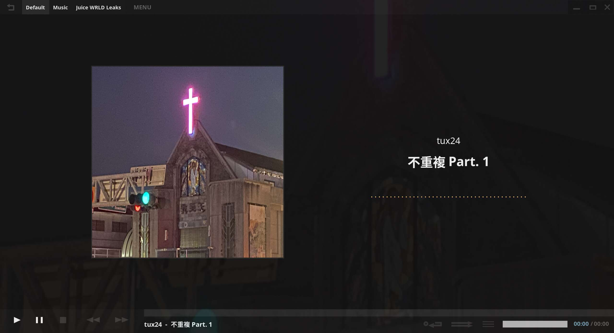

讀者可能有注意到，我的文章有些會有 Part. 1、Part. 2。我喜歡這種 「Part. X」，因為這有一種系列感、專輯感。

我一直都很嚮往那些音樂人，他們可以做出[這些專輯、EP、MIXTAPE](https://tux24.xyz/reviews)，然後把它們打包、發行，完成一個獨立的作品。
這些作品有他們獨立的封面、編排、概念、長度、內容，我有想要類似的東西。
可惜我不會做音樂，目前也沒有做音樂的打算。
所以我把我的文章類似這樣透過 Part1、Part2 的方式包裝成一個系列，要說是一張專輯也可以。

例如我喜歡的系列「[不重複](https://tux24.xyz/articles/i-hate-repetition)」，我就一直很想為它寫一個 Part. 3。
我確實寫了沒錯，但是因為我對那個草稿不滿意，所以到現在都沒有發。

而也是這種「只有創作者自己知道他做了多少作品」的感覺在吸引我：有哪些發了、哪些沒發？有哪些躺在他的硬碟裡、筆記本裡、手機裡、隨身聽（還有人用隨身聽嗎？）裡？只有創作者自己知道（忽略 [Leaks](https://tux24.xyz/articles/two-juice-wrld-concept-album)）。

我，做為一個消費者，我想要知道創作者的創作歷程、他們未發布的作品。我很嚮往他們、想成為他們。所以我寫這些系列文章。

我試著將我的不重複系列加上這一張我隨便拍的照片。
把照片切成正方形，然後拼成一張專輯的樣子。

以下是我用我的音樂播放器（請看 [/use](https://tux24.xyz/use)）模擬的結果：

_變高級很多嘛。_

在不同專輯之間，不是也會有些歌曲與歌曲組成的系列嗎？
我也嚮往這種有很多作品之間互相聯繫的感覺，不一定要明著當續集，精神續作或是暗示以前作品的內容也不錯，不過這有點離題了。

極客死亡計畫就有一個[「泳道」頁面](https://www.geedea.pro/categories/)展示系列文章；[Eddie](https://eddielv.com/series/) 也有幫文章分系列，方便閱讀；Alex 除了[分專題寫作](https://alexhsu.com/topics)外，還打算[把專題文章編成一本書](https://alexhsu.com/game-mindset)。或許我也可以為我的 Blog 這麼做。正好我最近深感 [/articles](https://tux24.xyz/articles) 名不符實，混入了很多不算是「文章」的東西，既然我想滿足我的「專輯欲」，不如趁這個機會？

「文字專輯」，有人這麼描述過一系列的文章嗎？還是只有書最符合這個概念？如果我為我的文章排個順序、統計長度（字數？）、文章名字取得短一點、找一張圖片切成正方形當封面（我喜歡正方形的圖片，排起來才好看）、取個專輯名、最後放在我的「文字專輯牆」上，會不會很有[成就感](https://tux24.xyz/articles/logging/)？ ... 好像就跟寫了一本沒出版的書差不多，但「我寫了一本書/我做了一張專輯」不管哪一個放到我身上都有種[死而無憾](https://noa.bearblog.dev/team-die-vs-team-live/)的感覺（我是不是太小看自己了？）。

---

本文原稿錄製於 2026-04-28 00:00 左右，在我家空無一人的黑暗客廳，對著我的手機麥克風。

隔天整理完文章我把它丟給 ChatGPT 看看有沒有大問題需要修改，但我對它的意見反感，最終一字未動。