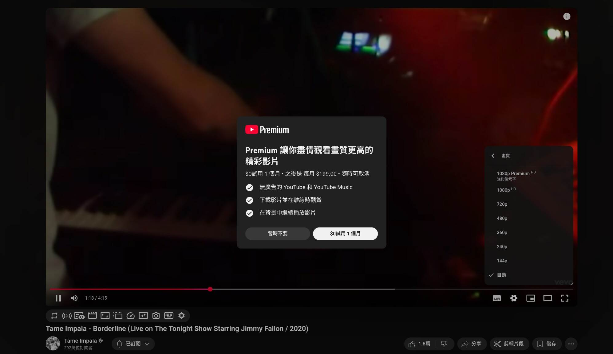

已經一陣子沒打開過 YouTube 官網了，剛才看了 Tame Impala 的最新 MV 後轉到他們的這個現場表演影片。我覺得畫質很糟就打開了選單想要調高一點，沒想到看到這個：

# YouTube 末日不遠了

有沒有人能告訴我這個愚蠢的「Premium 強化位元率」是什麼時候出現的啊？

我之前都用手機螢幕看 YouTube 影片，沒發現 [YouTube 的位元率變得這麼低](https://wiwi.blog/blog/youtube-bitrate)，我覺得 YouTube 真的不行了 ...

雖然我自己沒有創作影片，但我還是在這邊建議每個影片創作者和我[自架網站](https://tux24.xyz/articles/build-your-own-website-1)放圖文內容一樣，自己架一個網站放你的影片。

好處我就不贅述了，你可以用 PeerTube 來架設。

