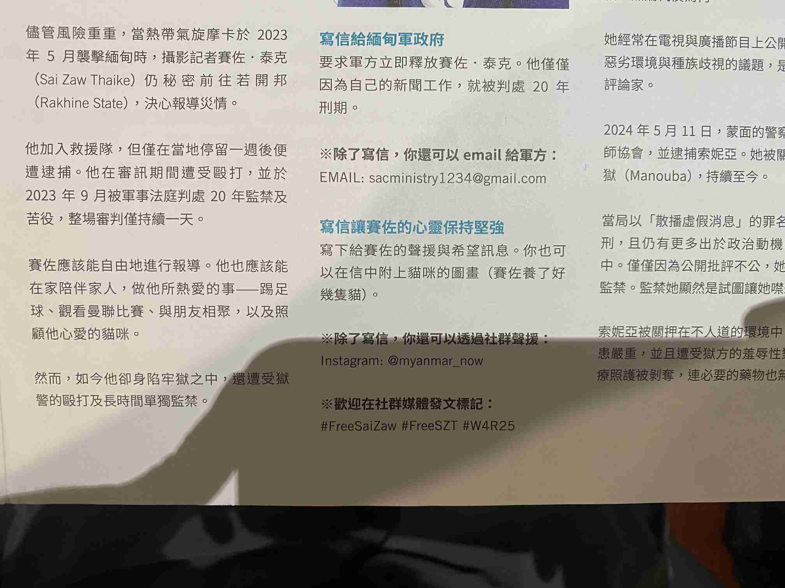

我今天才想起來去年底參加[國際特赦組織](https://www.amnesty.tw/about)的[寫信馬拉松](https://www.amnesty.tw/take-action/writeforrights/about)的時候看到了一個很好笑的東西，可是當時沒有發在 Blog 上分享：

這是活動海報的一角，如果你要對關押攝影記者 Sai Zaw Thaike 的緬甸軍政府施壓的話，除了和我一樣寫實體信以外，還可以寄 Email 到 **sacministry1234@gmail.com** 這個緬甸國家管理委員會的郵件地址。

哇靠，也太不專業了吧🤣。實在難以想像軍政府的某個小人員[^1]坐在電腦前註冊這個信箱時的樣子，所以 sacministry@gmail.com 到 sacministry123@gmail.com 是都被註冊走了嗎？我很好奇這樣 Google 是不是也有一份來信。

去年的寫信馬拉松活動好像已經結束了，但 **sacministry1234@gmail.com** 永遠[^2]開放！沒參加到活動的人現在還是可以寫信對他們施壓。不過不要提醒他們換個信箱，我覺得這樣不錯。

[^1]: 應該是吧，他們不至於連自訂域名服務的錢都付不起吧？
[^2]: 如果 Google 沒停權他們或是他們沒想到要改成自訂域名的話