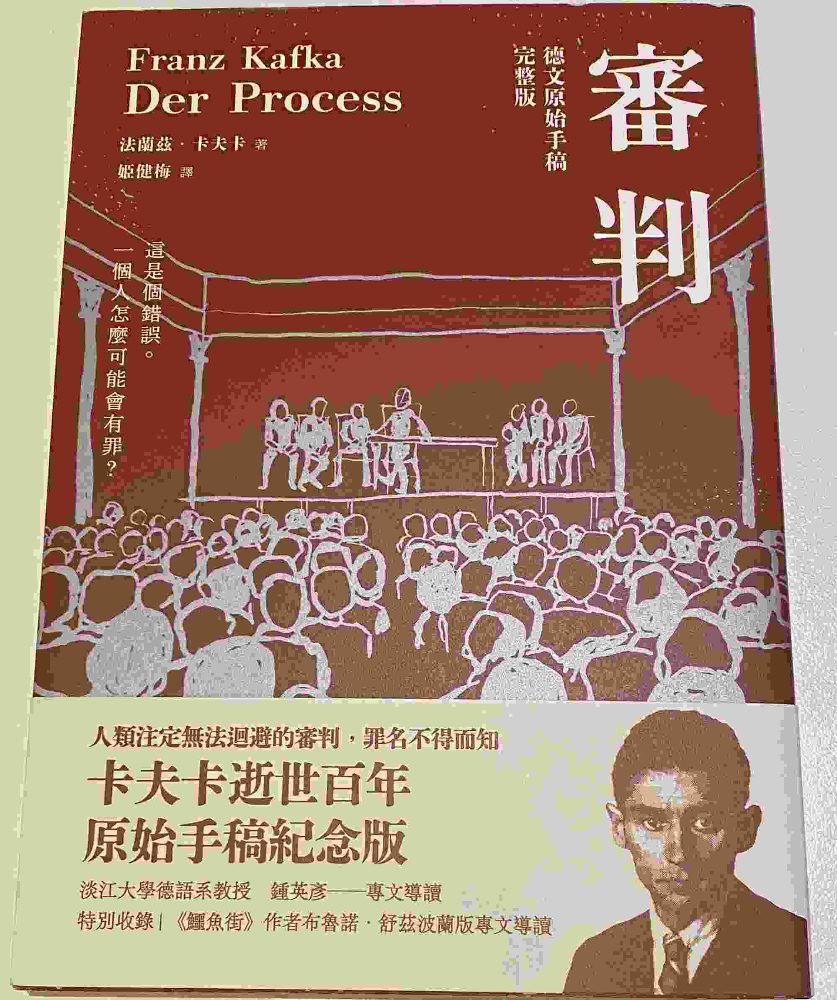
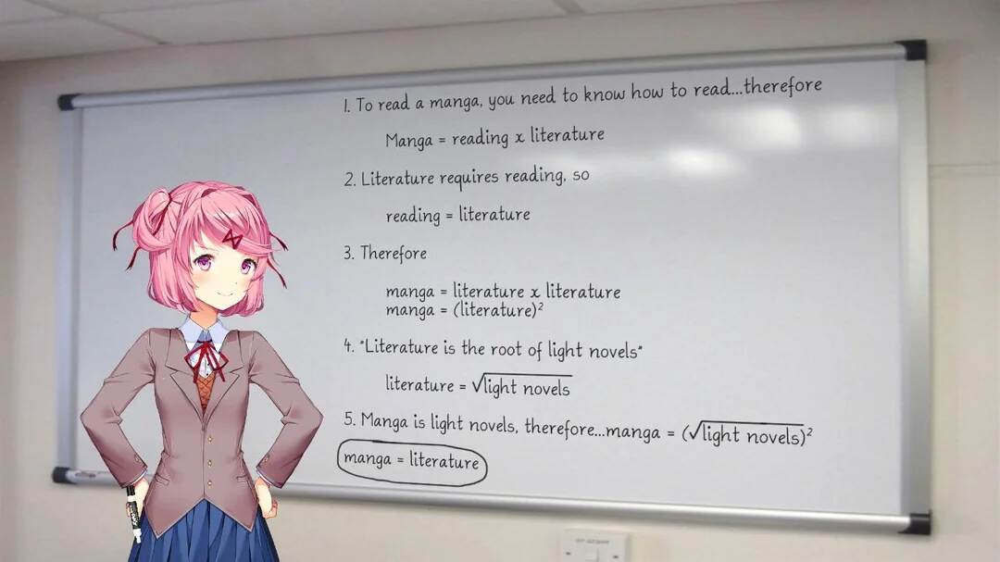

我一直認為游戲是「最高級的藝術」，以表現方式的豐富度而言。

# 為什麼？

讓我們看看比較「低級」的藝術，例如文學：

我們在看這本書時要如何進入卡夫卡創造的世界？

閱讀他寫下的文字，就這樣。

沒有更進一步的補充，文字以外的一切讀者都得自己想像，每個人的理解都不盡相同，就像那句話：

> 一千個讀者有一千個哈姆雷特。

... 挺 [Based](https://tux24.xyz/articles/based) 的。

相對於文學，再高一層的可能是漫畫，圖像加上文字。

好啦，我知道[^1]：

再往上走，我們有了電影和電視劇；連續的圖像，還有漫畫沒有的聲音。

最後（到目前為止），我們有了遊戲。

遊戲是第九藝術，它有另外八大藝術所沒有的一加一個元素：

# 互動性（還有遊戲性）

## 互動性

遊戲一定有互動性，我們操控著主角行動本身其實不也是「打破第四面牆」的一種形式嗎？

以「第四面牆」原本的定義來說：

> The fourth wall is a performance convention in which an invisible, imaginary wall separates actors from the audience. While the audience can see through this "wall", the convention assumes the actors act as if they cannot.
> — <cite>[英語維基百科](https://en.wikipedia.org/wiki/Fourth_wall)</cite>

雖然我們還是把自己代入主角的人設，主角通常也不會在遊戲中道破自己被玩家操控了的事實，不過想像劇場的情況，觀眾可以控制劇情的走向這件事應該算是打破了第四面牆吧？

我們好像可以說，現在打破第四面牆還有程度之分。

## 遊戲性

至於遊戲性就不一定存在，或著說，遊戲性有強弱之分，在遊戲中的佔比也有多有少。

舉例來說，Slay the Spire 就是遊戲性佔比很高的一個好例子，而它確實也是以遊戲性作為最大的賣點。

相對來說，Milk 系列就沒有那麼多的遊戲性，你要做的只是選擇不同的對話選項，或是點擊不同的物件來觸發劇情，你可能就不會覺得那麼好玩。

# 總結

有了互動性，遊戲的豐富度 > 其他八大藝術，所以遊戲是最高級的第九藝術。

# 所以呢？

... 不重要啦。

敬請期待我的最新專案😈

[^1]: 我知道 Natsuki 的數學不太好，不過語文能力還不錯

