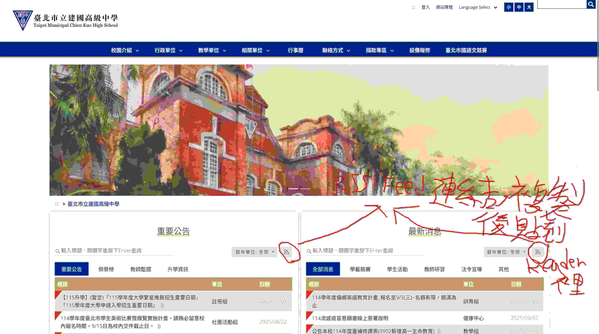

剛開學的最近幾天常常聽到有老師這麼說：「要常常看我們學校的官網首頁的『重要公告』和『最新消息』喔！最好每天看一次，不然至少也要每個月看一次。」

知道 RSS 的存在的我（可能還有別人）聽到這句話只會在心裡偷笑：

**用 RSS 不就好了？**

# 有趣的事實

有趣的事實：有人早在 1999 年就解決了需要每天上去檢查同一個網站時很麻煩的問題，舉例來說：如果網站[這麼肥](https://wiwi.blog/blog/jelly-bigger-than-games)，每天檢查不就只是在浪費時間和網路流量嗎？

這個問題的解答名為 [RSS](https://www.jaron.tw/blog/rss-reader/)。

# RSS 是什麼？

簡單來說（根據我不完整的理解），就是網站會自動生成一個遵守 RSS 規範的頁面，叫做 RSS Feed。每次 RSS Reader 更新時會去抓取 RSS Feed 的內容呈現給讀者，這也是為什麼我寫了[這篇文章](https://tux24.xyz/articles/smart-rss-feed-strategies/)，告訴你我認為網站擁有者要如何設定 RSS Feed，因為 RSS Feed 的內容是由網站擁有者決定的。

# 那所以建中的官網有 RSS Feed 嗎？

有的，而且還非常顯眼：

_(把那兩個按鈕的連結複製起來貼到 Reader 裡就大功告成了)_

有了這來自 1999 年的魔法，以後你們就不用「每天打開官網了」，不客氣。

# 讓我碎念一下

雖然我知道[不應該這麼做](https://wiwi.blog/blog/youtubers-talking-about-youtube)，但是如果你很感謝我的話，你可以訂閱我的 RSS Feed，連結是：[https://tux24.xyz/index.xml](https://tux24.xyz/index.xml)。謝謝你。