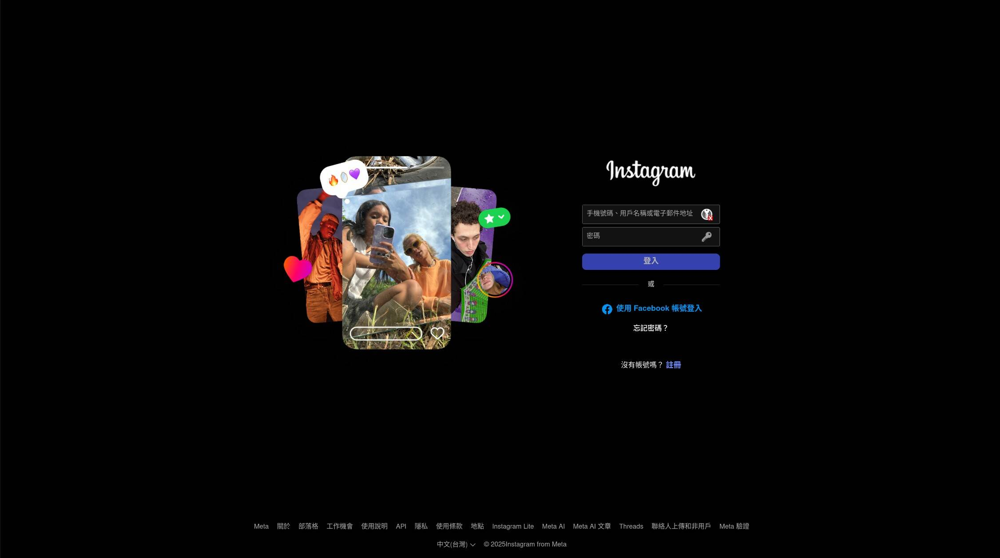

現實中太多人問我這個問題了，他們的第一個問題會是：「你有 IG 嗎？」（預設答案是有），第二個問題就會是：「為什麼你不用 IG？」。

非常好問題，以下內容是寫給感到疑惑的你們看的，這樣我就不用[每次都解釋還要擔心講錯話](https://tux24.xyz/articles/i-have-written-that-before/#%e6%96%bc%e6%98%af%e6%88%91%e6%8a%8a%e4%be%86%e9%be%8d%e5%8e%bb%e8%84%88%e5%92%8c%e4%bb%96%e8%aa%aa%e4%ba%86%e4%b8%80%e9%81%8d)了。

# 1. 我不喜歡 IG

如果你有讀過我其他文章，你一定很清楚，但這篇文章是寫給新讀者看的所以我再寫一次：

1.  **IG 的作用是什麼？**
	
	我也很好奇，所以我剛才打開了 https://instagram.com：

	

    蛤？所以這個平台是會員限定，沒建立帳號的人連裡面在幹嘛都不知道喔？[^1]

	很抱歉各位讀者，我沒有 IG 帳號所以關於它有什麼作用我也寫不出來，可能祖克伯不想讓我知道🤣

2. 那想必**會員應該不少吧**？既然他們這麼有自信：

	[結論點我](https://wiwi.blog/blog/ig-login-wall/)
	
	呃 ...
	
3. 好吧，其實就我現實生活中的體驗是幾乎每個人都有 IG 帳號的（可能因為我是高中生），那我們來看看他們平常使用 IG 的時候在看什麼：

	**問卷調查時間**！如果你自己有在使用 IG 的話（要目前有在使用的，身邊其他人有在用但自己不用的不算）麻煩看一下 [`/contact`](https://tux24.xyz/contact) 然後跟我說**你平常用 IG 的時候都在看什麼樣的內容**。
	
	我會把你們的回覆貼在下面，所以請註明你想不想要我把你的個人資料也寫在這邊[^2]，想宣傳自己個人網站（或是，好吧，IG 也行）的人這是你們的大好機會！我也可以順便測試自己的影響力目前有多大。
	
	我本來是想直接寫我在班上觀察到的現象的：看幹片、迷因和擦邊圖[^3]，但後來覺得這樣有點太偏頗了所以乾脆直接問你們意見。
	
4. 那既然都做問卷調查了，那我等問卷調查結果出來後再繼續寫吧🤪

# 2. 我不需要 IG

老實說，如果我想要滿足我的 [FOMO](https://tux24.xyz/articles/hell-yeah-and-fomo/) 的話，我是需要 IG 的。但我現在盡可能的讓自己 [JOMO](https://wiwi.blog/blog/jomo)，所以我不需要 IG。

重要資訊都放 IG 的社團、沒有個人網站只有 IG 的讀者其實才是我不使用 IG 的最大阻力，但前者我會加入他們然後幫他們架官網、後者我會在這邊想盡辦法說服，沒什麼好怕的，反正如果失敗了也就算了（攤手）。

# 3. 如果我有 IG ...？

那我的 FOMO 和手機成癮只怕會加劇。我已經在[另一篇文章](https://tux24.xyz/articles/start-writing-asap)寫過這個問題了，有點悲觀的預測是最後這裡將會死掉，然後我的學業成績一落千丈因為上課都在滑 IG。

[^1]: 後來我也去看了 https://facebook.com、https://x.com 結果發現大家都一樣有自信
[^2]: 沒註明的話我會幫你匿名
[^3]: 這是我同學的用詞，我本來不會用這個字眼
