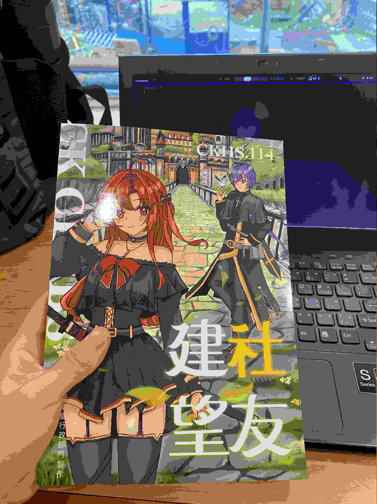

今天（2025-08-21）參加新生始業輔導，午餐時間有好多社團來宣傳喔，對於國中社團風氣不彰、八年級以後社團活動時間還被拿去上資優班的課的我來說很新奇，同時當然也很期待。

# 但是

給你看我拿到的一些傳單：

圖片可能不清楚，我直接講我的結論。

**為什麼都只有 IG 社帳啊！😡**

再給你看《建社望友》[^1]：

_（我把它壓縮成像素風格了 www）_

我就不拍內頁了，結論是一樣的：

**我沒看到哪一個社團有放自己的官網，全部都是 IG 社帳，還寫「重要資訊請看社帳/歡迎 DM」之類的。**

可惡，這三年想不用 IG 的阻礙還真多，看來只能用實體的方式去獲得這些重要資訊了。

[^1]: 建中一年出一本的刊物，內容都是學校各社團的介紹，給新生看的。1982 年創刊，所以那個諧音梗已經 43 歲了