這是我的「[BlogBlog 同樂會 - 2026 年 1 月](https://blogblog.club/party)」的投稿文章。本月主題是「[推坑](https://wiwi.blog/blog/blogblog-party-jan-2026/)」，由 [Wiwi](https://wiwi.blog/) 主持。如果你有自己的部落格，歡迎一起來參加！

好久不見，我來推坑一個我的童年最愛遊戲。

# World's End

不知道讀者有沒有經歷過十幾、二十年前 Flash 網頁遊戲鼎盛的時期，在手遊普及前，網頁遊戲大概就是門檻最低的遊戲方式了。我小時候（約 2016、17 年）其實已經接近 Flash 的晚年，不過在我開始玩主機遊戲之前，都是在[遊戲天堂](https://www.i-gamer.net)上玩~~不知道有沒有版權問題的~~遊戲。

我從那時就對回合制戰棋很有興趣，一直在網站的這個標籤頁面尋覓一款在遊戲性和美術、世界觀都能滿足我的選擇（當時還不在乎音樂）。後來終於讓我找到了 **World's End（世界的盡頭）**。

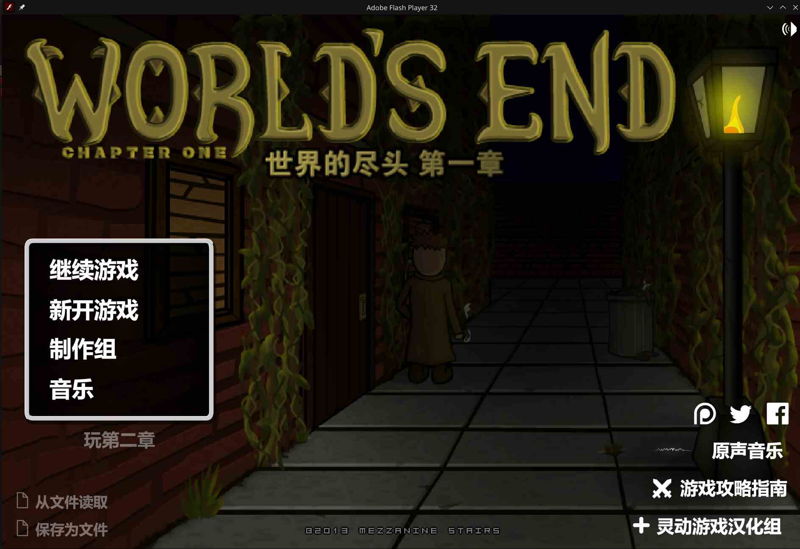

簡要的介紹一下，World's End 是一個黑暗奇幻風（當時很喜歡奇幻風）回合制戰棋遊戲，遊戲流程很簡單：過場對白-›開打-›過場對白-›開打-›過場對白...（隨時可存檔）。劇情背景設定在一個虛構的類 19 世紀大陸，有火車、槍炮、魔法，但大多數角色還在用冷兵器。

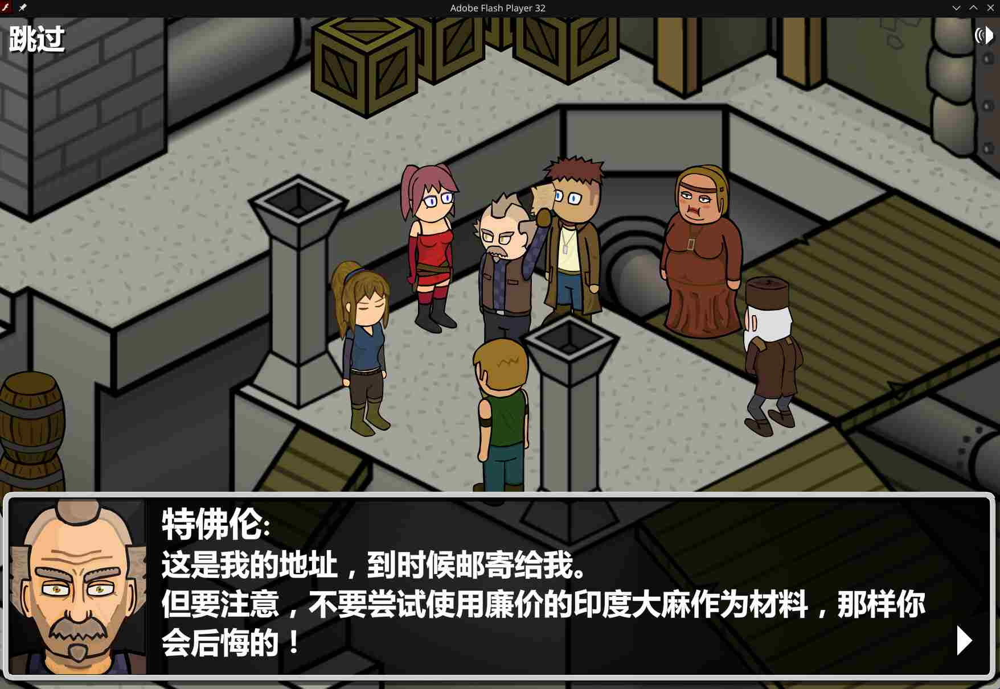

_不是，爲什麼有「印度」大麻？_

我目前玩完的第一章[^1]劇情基本上就是流氓打架，套用網路流行語的話就是「沙雕」，不過感覺對後面的第二、三章有所鋪墊。

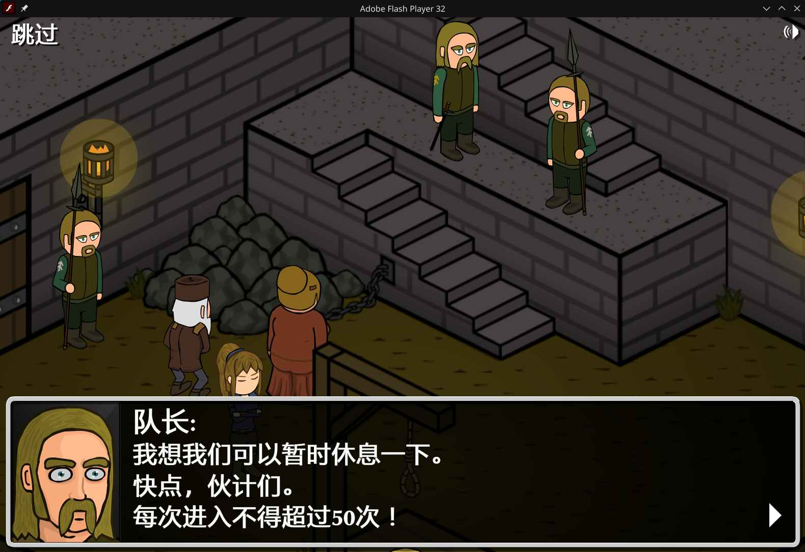

_我看到這句對白的時候愣了三秒。_

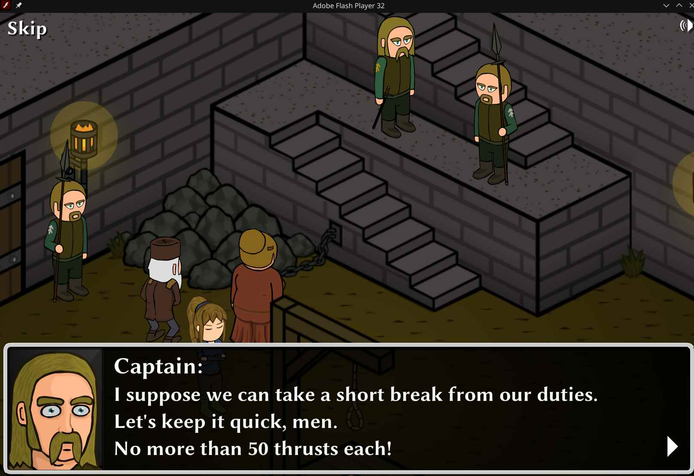

_看到原文又愣了三秒。_

[^1]: 因爲網頁遊戲需要，分成三章，檔案大小加起來不如[仙草凍](https://wiwi.blog/blog/jelly-bigger-than-games)

這遊戲好玩的地方還在戰鬥環節。

## 戰鬥機制

在「開打」環節中，玩家要操縱隨着劇情進展越來越龐大的主角團，在每一關相異的地圖上移動並攻擊敵人，達成當關卡要求的目標任務即勝利（通常是「全殲敵人」）。主角除了普攻外，還有技能和物品可以用，技能必須透過擊倒敵人的過程中獲得的「技能點」來學習，物品則是擊倒敵人時獲得或是在戰鬥環節之間的商店購買。

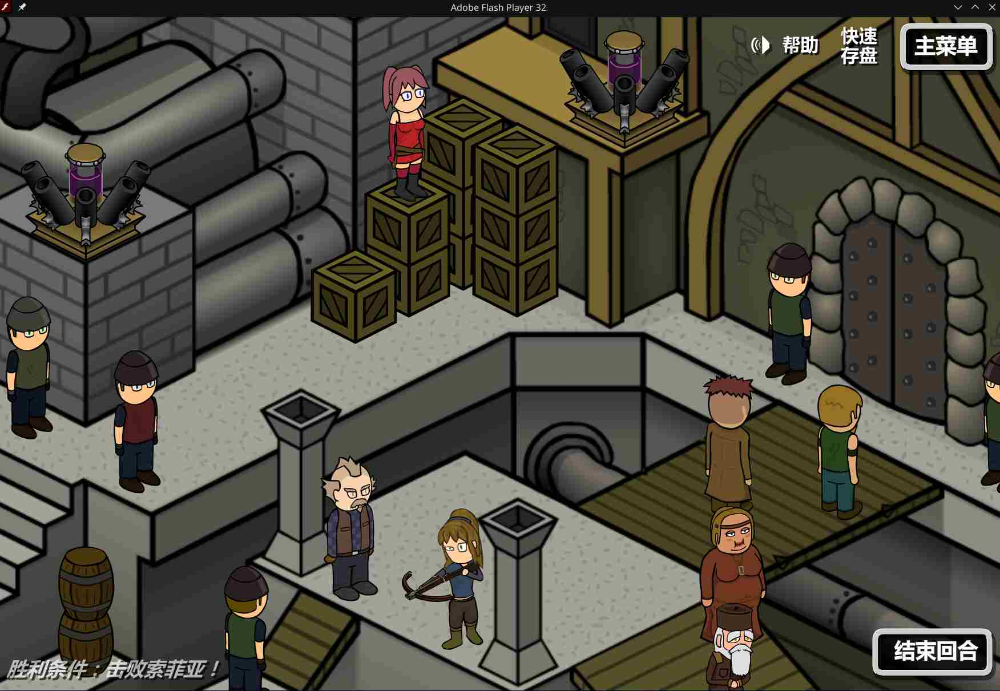

_複雜的地圖，有很多可互動元素和其他小細節，遠超 Flash 遊戲的平均水準，玩起來一點都不無聊_

遊戲非常的人性化，不止隨時可存/讀檔、角色還能遺忘已經學會的技能並全額返還技能點，好讓玩家探索不同流派的戰鬥方式。

至此，和市面上一般的回合制戰棋沒有甚麼不同，其他戰棋遊戲沒有的機制才是重點：

### 丟屍體

對，你沒聽錯，每當一個敵人或主角團的成員被擊倒，他們不會消失在地圖上，而是原地倒下，變成可互動的元素。你可以操縱角色讓他們移動到屍體附近，並把屍體拿起來丟，或是把屍體疊到一定的高度，用來擋住你想擋住的敵人的子彈或是封路。

不要小看這個有點荒謬的細節，這可是這個遊戲的精髓所在！每個角色的行動點都只夠最多兩次普攻，如果還要移動的話，只能使用一次普攻；但如果用丟屍體當作攻擊的話，一回合可以丟最多五次，而且屍體造成的傷害總和可能超過兩次普攻。除此之外，原本不能遠程攻擊的角色也可以用丟屍體的方式打到遠處的敵人。玩到後面比較難的關卡你就會發現，在這遊戲中你考慮的最多的，是屍體要放在哪裡🤣

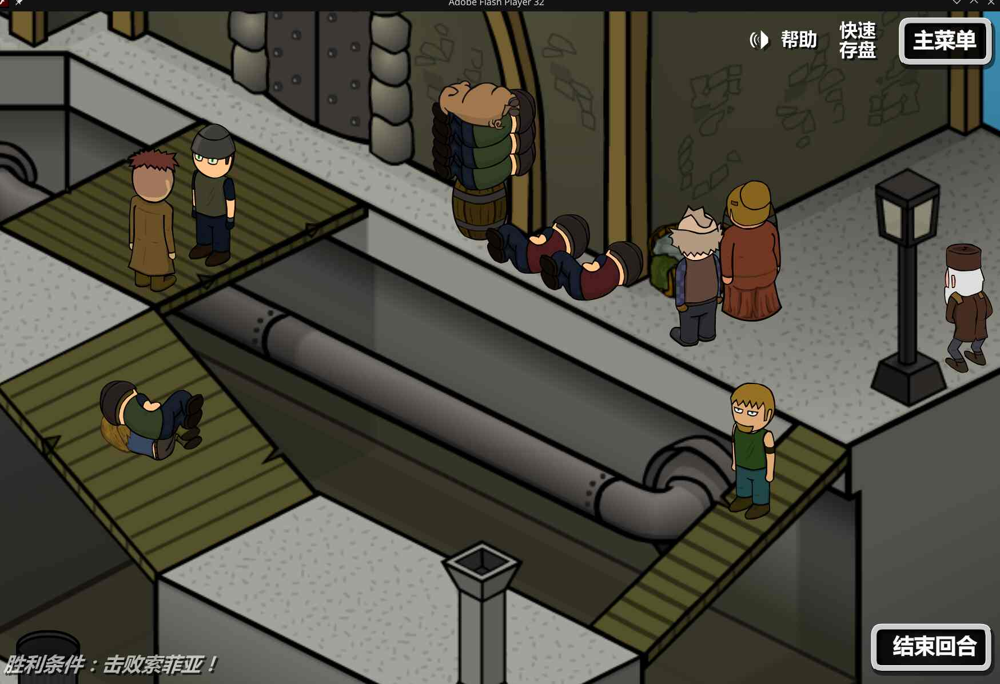

_用屍體擋路_

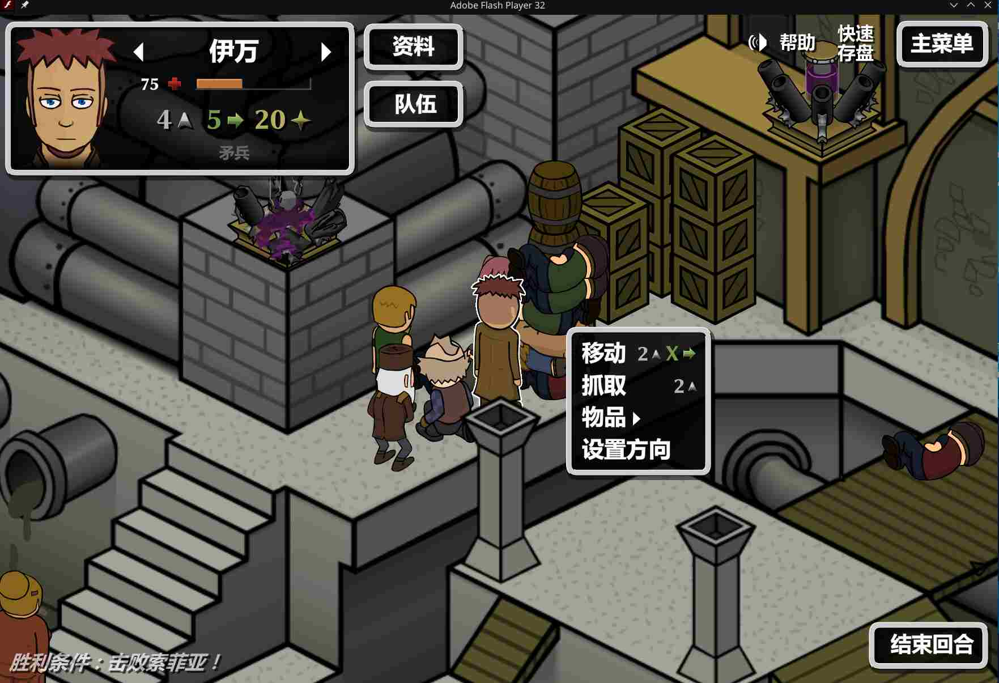

_用屍體對付會一直從高處對我丟燃燒彈的敵人，還好這關沒有回合數限制，我試了好久_

## 哪裡可以玩到這個遊戲呢？

由於 Flash 已經停止支援了，要在網頁上玩到這個遊戲有難度，好在原作者 Mezzanine Stairs 現在正在重製這個遊戲，你可以在 [Steam](https://store.steampowered.com/app/3245070/Worlds_End/) 上找到遊戲頁面。

### 那如果我現在就想玩呢？

問到點上了，現在想玩 Flash 遊戲有兩種方法：第一種是 [Ruffle](https://ruffle.rs/)，我試過了行不通；第二種是透過 [Flashpoint](https://flashpointarchive.org/)，但 Flashpoint 上只有收錄 Story Mode（只有過場動畫和對白，跳過了戰鬥環節）和原聲帶，所以必須自己搞到原遊戲的檔案。

#### 教學

遊戲天堂上的 World's End 只有第一章，讓我們來找找遊戲檔案…

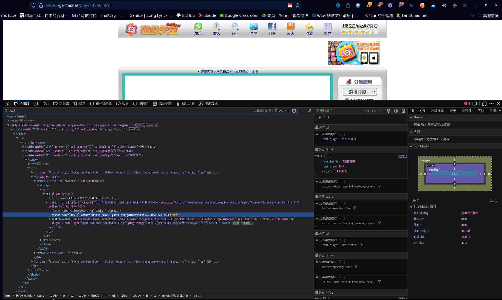

找到了！接着來找第二和第三章的…

透過遊戲天堂上下載的這個第一章漢化組檔案，我們能得知遊戲天堂其實只是搬運了 [靈動遊戲](https://www.mhhf.com) 的內容，讓我們來搜尋靈動遊戲官網上有沒有剩下的兩章…

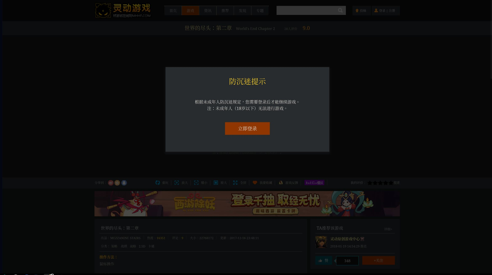

喔不，是中國法規。不過沒關係，我們可以故技重施。

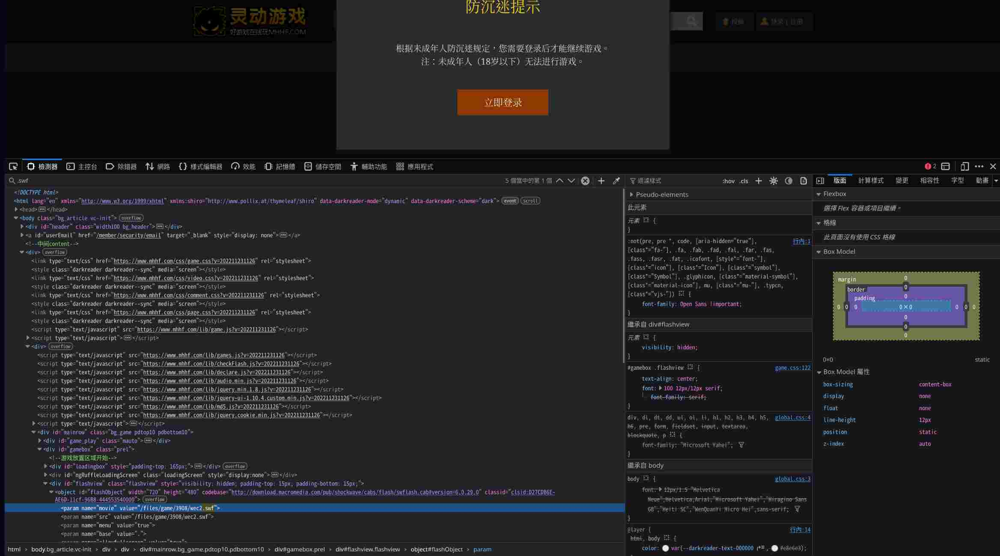

沒想到這麼輕易就獲得檔案了，這個防沉迷機制只防得了不會用瀏覽器的人…

我在這裡整理第一章漢化版和第二章、第三章原版的連結（**應該只是單純的 Flash 檔案，但我不能保證沒有病毒**），省得時間：

第一章漢化版：[http://www.i-gamer.net/gamd89/flash5/6.3666_WorldsEnd.swf](http://www.i-gamer.net/gamd89/flash5/6.3666_WorldsEnd.swf)

第一章：[https://www.mhhf.com/files/game/3909/wec1.swf](https://www.mhhf.com/files/game/3909/wec1.swf)

第二章：[http://www.mhhf.com/files/game/3908/wec2.swf](http://www.mhhf.com/files/game/3908/wec2.swf)

第三章：[http://www.mhhf.com/files/game/3936/SJJT.swf](http://www.mhhf.com/files/game/3936/SJJT.swf)

獲得檔案之後，想用 Flashpoint 玩到遊戲還必須經過一個步驟。由於 Flashpoint 預設只能玩它的遊戲庫裡有的東西，所以我們必須「假裝」World's End 是遊戲庫裡的東西，具體操作如下：

1. 安裝 [Flashpoint](https://flashpointarchive.org/downloads)
1. 到 Flashpoint 的設定頁打開 "Enable Editing" 功能
2. 按照 [Flashpoint 官網維基的說明](https://flashpointarchive.org/datahub/Curation_Format)，我們必須製作一個完整的 "Curation"，上傳到他們的遊戲庫（還要等審核），才能玩到遊戲。我們只要自己玩就好，不用管那麼多，有興趣可以再自己研究。單純想玩的話可以照抄我接下來的步驟：
3. 建立三個資料夾，名字隨便取，但每個資料夾裡面都要包含一個 content 資料夾和一個 meta.txt 純文字檔
4. content 資料夾裡面要有一個和原始檔案連結一模一樣的資料夾結構，假設原本是 http://aaa.com/bbb/ccc/ddd.swf 的話，就要在 content 資料夾內建立 aaa.com/bbb/ccc/ 的資料夾結構，然後在 ccc 資料夾內放入 ddd.swf（你剛下載的檔案）
5. meta.txt 的內容你可以直接抄我的，但其實除了 Platform 和 Application Path 那欄應該都可以亂填
6. 處理好三個資料夾之後，把三個資料夾**分別**壓縮成三個 .zip 檔
7. 到 Flashpoint 裡面打開 Curate 頁面，點右手邊的 "Load Archive" 按鈕，選擇你剛壓縮好的檔案，重複三次
8. 這時畫面最左邊應該會出現三個不同的 Curation，點選你要玩的那個然後按下右邊的 "Run" 按鈕就可以開始玩了！

以下為 meta.txt 的內容，填 "1" 的欄位是因為我懶得認真寫裡面的內容所以全部都填 "1"：

第一章漢化版：

```
Title:World's End CH 1 Zh
Alternate Titles:
Library:Game
Series:World's End
Developer:Mezzanine Stairs
Publisher:Mezzanine Stairs
Play Mode:Single Player
Status:Playable
Release Date:1
Version:1
Languages:en
Extreme:No
Tags:RPG
Source:https://www.i-gamer.net
Platform:Flash
Application Path:FPSoftware\Flash\flashplayer_32_sa.exe
Launch Command:http://www.i-gamer.net/gamd89/flash5/6.3666_WorldsEnd.swf
Notes:1
Original Description:1
Curation Notes:1
Additional Applications:1

```

第一章：

```
Title:World's End CH 1 Eng
Alternate Titles:
Library:Game
Series:World's End
Developer:Mezzanine Stairs
Publisher:Mezzanine Stairs
Play Mode:Single Player
Status:Playable
Release Date:1
Version:1
Languages:en
Extreme:No
Tags:RPG
Source:https://mhhf.com
Platform:Flash
Application Path:FPSoftware\Flash\flashplayer_32_sa.exe
Launch Command:http://www.mhhf.com/files/game/3909/wec1.swf
Notes:1
Original Description:1
Curation Notes:1
Additional Applications:1

```

第二章，原本有漢化版但是因為它 bug 太多所以後來我改玩原版：

```
Title:World's End CH 2 Eng
Alternate Titles:
Library:Game
Series:World's End
Developer:Mezzanine Stairs
Publisher:Mezzanine Stairs
Play Mode:Single Player
Status:Playable
Release Date:1
Version:1
Languages:en
Extreme:No
Tags:RPG
Source:https://www.mhhf.com
Platform:Flash
Application Path:FPSoftware\Flash\flashplayer_32_sa.exe
Launch Command:http://www.mhhf.com/files/game/3908/wec2.swf
Notes:1
Original Description:1
Curation Notes:1
Additional Applications:1
```

第三章：

```
Title:World's End CH 3 Eng
Alternate Titles:
Library:Game
Series:World's End
Developer:Mezzanine Stairs
Publisher:Mezzanine Stairs
Play Mode:Single Player
Status:Playable
Release Date:1
Version:1
Languages:en
Extreme:No
Tags:RPG
Source:https://www.mhhf.com
Platform:Flash
Application Path:FPSoftware\Flash\flashplayer_32_sa.exe
Launch Command:http://www.mhhf.com/files/game/3936/SJJT.swf
Notes:1
Original Description:1
Curation Notes:1
Additional Applications:1
```

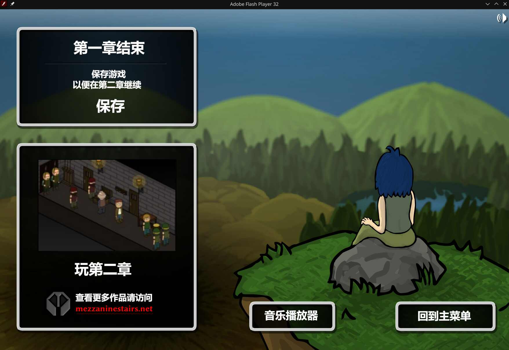

這是玩完第一章時的畫面。