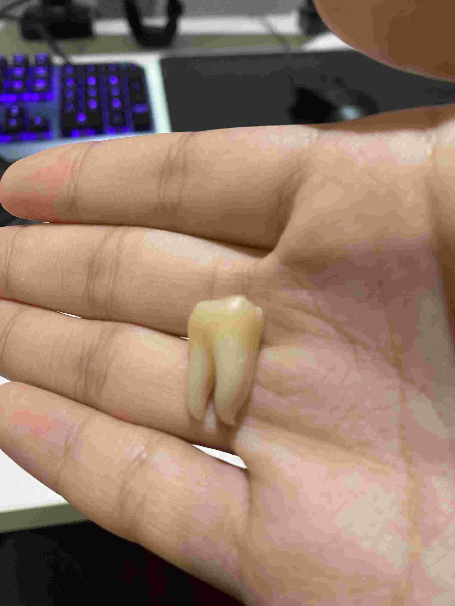
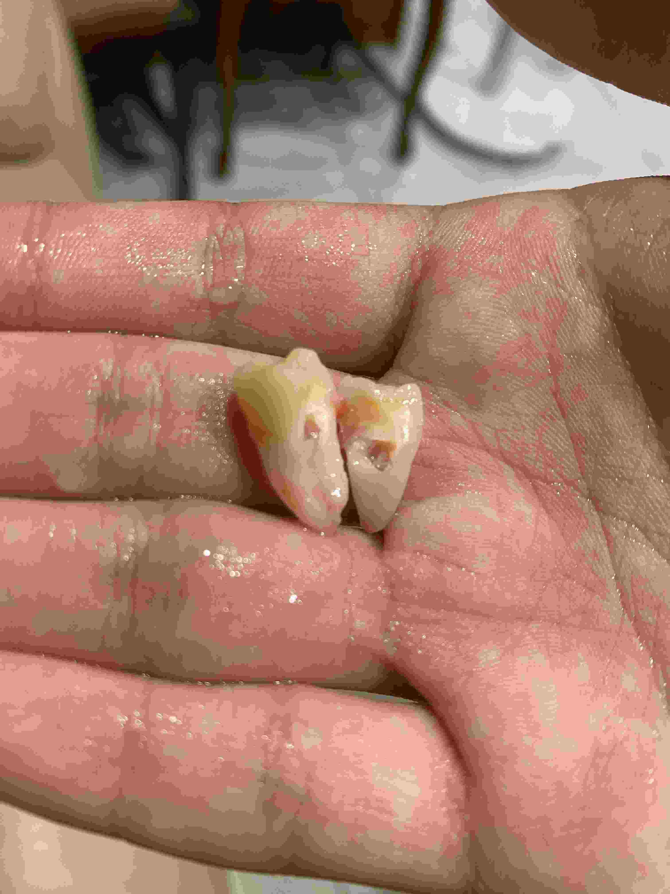

今天（2026-07-09[^1]）拔了我右下側的智齒，因為和上次不太一樣，加上 Marcus 在上一篇文章發布的隔天也分享了[他以前拔智齒的回憶](https://immarcus.com/blog/extracting-wisdom-teeth)，順便回應一下。

[^1]: 對了，我好像沒分享過，我之所以會在文章中提到相對的時間名詞（如：今天）時一律加上絕對的時間名詞（完整日期）是因為我有一種莫名的擔心：萬一文章的標題、作者這些 metadata 都不見了，文章中的日期就可以推斷出不少資訊。

## 痛死了，根本睡不著

上一篇文章結尾寫完發布後過沒多久情況就急轉直下，我太晚吃止痛藥了，直到要入睡時痛得不可思議，怎麼會這麼痛！在床上輾轉反側就是睡不著，那天十二點左右上床，大概兩點才在未消的疼痛中入睡吧。

結果隔天早上起來之後一點也沒感覺，昨晚發生的事就像一場夢，我確信是止痛藥的效果，所以接下來幾天，雖然和醫生說的不一樣，沒有再發疼過任何一次（醫生說會痛兩、三天）但我依然像個癮君子般準時服藥[^2]，生怕停藥之後疼痛會再次襲來。

[^2]: 我吃的止痛藥不是近年美國 Rapper 歌詞[很常](https://genius.com/Lil-uzi-vert-space-high-lyrics)出現的「Percocet」那種鴉片類止痛藥，應該是不會上癮。

## 漏掉的照片

上次忘了放我拍的智齒照，它的長度和我的中指寬度差不多，好長啊。

今天拔的這顆也一樣，~~果然都是我的親生骨肉~~。

因為鋸開了，可以看到裡面的空洞部分。

## 電鋸狂魔的血腥場景

上次對拔牙的期待極低，以為是一場苦戰，結果七分鐘搞定，不論是不是醫生技術的問題，我已經決定要把我所有的智齒都交給他拔了，就算他在這間診所的看診時間從單週改成雙週我也要來。

今天要拔的這顆智齒和上次有很大的差別，**它還沒露出來**。事實上我可以更早預約拔牙，但我存著一絲「再等一陣子看它會不會長出來，這樣可能比較好拔」的僥倖，於是拖到今天。

我一點也不緊張，有了上次的成功經驗就知道沒什麼好怕的。上次醫生不知道用了什麼[魔法](https://immarcus.com/blog/world-of-magic)[^3]只用「拔」的就解決了，既然如此，有可能今天也用不到鋸子、槌子，說不定他的工具類似冰淇淋杓，可以把牙齒和覆蓋其上的肉一起挖走？

我錯了，拔到一半醫生才跟我說「我現在把它切兩半喔，可能會有點痛，你忍耐一下～」。

「完了，要來了，電鋸狂魔。」我想。

和 Marcus 描述的差不多，那聲音（因為有布蓋在臉上我什麼都看不到，不過就算沒有那條布我也是死閉著眼）聽起來是真恐怖，而且聲音的源頭就在我的口腔內，我腦中都浮現工地裡那種火花四竄的畫面了（應該是沒有啦）。

我全程都在想：「那我的舌頭可不能亂動，萬一我作死去往右舔是不是會被鋸掉？」，專注在舌頭的位置上，死撐著不敢動，也就這樣順便分散了注意力。電鋸聲止息後，又有東西進到我的嘴巴裡面搗鼓一番，之後助手（他原本在用工具吸出我的口水和血）和醫生的手都離開了我。

我想：「嗯？糟糕，不會是在準備下一輪的工具吧？槌子？」，不過驚喜馬上就來，醫生剛才是在準備縫線，他在我的傷口打了幾個結然後拉緊（好像打了不只一次結，上回只有一次），塞好紗布，助手拿走我臉上的布，我被通知可以下樓領藥了。

我從手術椅上起來時看了看手錶，20:52，記得我躺下去大概是 20:48 的事，四分鐘？！上次是七分鐘欸！

可能這位醫生真的有點厲害，這次我待的診間可以直接看到隔壁，我才知道醫生在等我麻藥生效的那段時間是去幫另一位患者打麻藥了，等我的智齒拔完他又要去拔下一顆，絲毫不浪費時間呀，不知道跟他的看診時間縮短有沒有關係。

---

我這次依舊非常滿意，開開心心的回家打這篇文章。我有算準時間在文章寫到一半的時候去吃止痛藥和抗生素，希望麻藥退了之後不要再來一次，我不要。

喔對了，拔智齒的自付費用是零元，由健保支付[^4]，只要每次拔牙的時候付 150 新台幣掛號費即可，相較美國是便宜太多了[^6]。

00:09 更新：麻藥藥效退了，還是好痛啊！

[^3]: 我對牙醫的認知和兩百年前的人比起來應該是沒進步多少。
[^4]: 健保費用是我媽固定支出的，我也不知道是多少錢😛。
[^6]: 不過 4500 美金已經是醫療詐騙了吧。