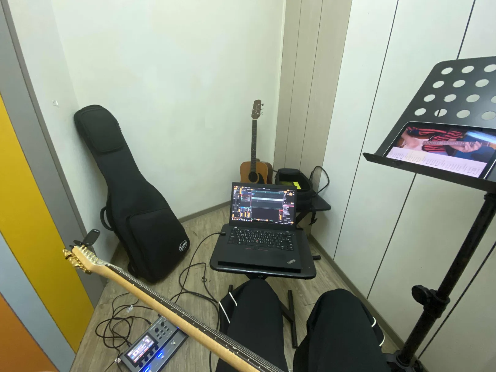
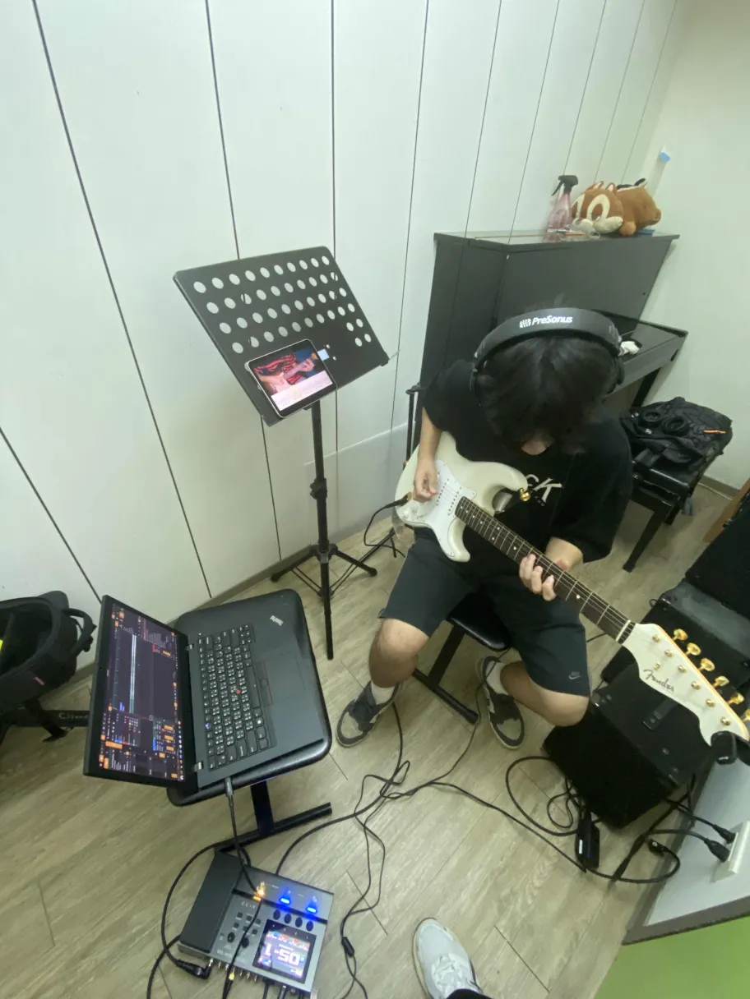

從六月開始我就想要用電吉他來錄 Cover，但這個計畫要一直到我在七月初買了一台 BOSS GX-10 綜合效果器（可以當音效介面用）後才有可能實現。

在那之前，理論上我可以先把電腦上的 DAW 設定好，不然我的拖延症又要犯了。說到 DAW，[Ardour 可是我第一個認識到的自由軟體](https://tux24.xyz/articles/freedom-day/)，當然是裝 Ardour 囉。

我現在自認不是個喜歡看文檔除錯的人，只會把錯誤訊息貼給 LLM 叫它搜尋一下論壇讓我看看，並且試前幾個解決方法，都不行就放棄。

這也是我面對 Ardour 閃退的態度，所以在七月快結束的今天早晨，我還沒讓筆電成功播出電吉他的聲音。昨天我覺得這樣不行，又重新開始嘗試修好 Ardour 的問題，無果。論壇上有人和我碰到一樣的問題，但沒人給出解答，我想不如直接換個 DAW。

聽說 Qtractor 和 LMMS 都比較適合 MIDI 編曲而非錄音，後者我沒試，前者還真的如此。我迷失在它的圖形介面中，和 Ardour 比起來差多了，我覺得很不友善。

我一路研究到了最近新獲得的一台 iPad Mini 和實體錄音機上。後者聽起來不錯但我沒錢了，也不想再適應新的工作流程。前者其實不能算是我的東西，只是我看我媽買來閒置已久，就和他借過來。我不得不承認 iPad Mini 的尺寸有很大優勢，看 pdf 的效果比 ThinkPad 好太多了，ThinkPad 又笨重螢幕又不如 iPad。iPad 的諸多缺點我就不贅述了，回到主題，這台 iPad 已經裝了最新版的 iPadOS（不像我的 iPhone 為了用上 TrollStore 還停留在 15.6，好多東西都裝不了了），也可以用 GarageBand，我沒想到行動版的編曲軟體還有能派上用場的一天，原本以為那只能當玩具。

所以我差點就用 iPad 錄音了，但一想到觸控的不便，勢必還是要用 電腦上的 DAW 編輯音訊檔案，還是得用 DAW，躲不掉。

我找到了一個新穎的 DAW —— Zrythm，我懶得看它的特色有哪些了，總之它的介面比較「現代化」、比較 GNOME 一點，但我覺得並不比 Ardour 好看到哪裡去，可能外觀問題的最佳解決方案是可自訂的主題。某些專有 DAW 似乎有此功能。

我研究了一下怎麼設定 DAW（效果器都不用設定，線接上去就能用），第一次把 GX-10 接上筆電，在 QjackCtl 中拉線解決 DAW 沒收到音的問題，然後，就好了。就是一個普通 DAW，但它做到了，我沒有再掛任何 Plugins，所有效果交給綜合效果器，感受到 Wiwi 說的[「硬體最可靠」](https://wiwi.video/w/atxUShe9B4UvELTwGYKStu)是什麼意思——不過其實綜合效果器上面也是一堆專有軟體，不是最可靠的，我總有一天要開始用單顆效果器 … 等我有錢了再說。

結果今天都沒練到琴。

在點三的琴房架出了一個簡易錄音室——我這樣稱呼它。

巧遇熱音社的朋友，借他玩一下。拍起來效果不錯。~~順便曬我新琴~~